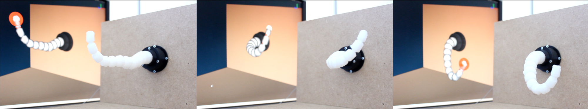

# SoftRobots plugin for SOFA

 
 

This plugin for SOFA contains components dedicated to soft robotics. You can find for example, models for cable and pneumatic actuations, tools to define trajectories for the robot's end effector, or tools to communicate with microcontroller boards.
Please refer to the dedicated [documentation](https://project.inria.fr/softrobot/install-get-started-2/) for installation and build. You can explore the *examples* directory in this repository to find examples and tutorials.

## Templates
The plugin also provides scene templates that can be used to make the writing of SOFA scene more easy. These templates are used in many of our examples, and can be found in the *python3* directory.   
A dedicated documentation can be found at this address: [https://softrobots.readthedocs.io](https://softrobots.readthedocs.io/en/latest/index.html)  
And general templates for SOFA can be found at this address: [https://github.com/SofaDefrost/STLIB](https://github.com/SofaDefrost/STLIB)

## Realsense camera module
This plugin also contains a component to retrieve and process point clouds coming from a realsense camera.   
To use it, you need to:
- download and install the latest release of the realsense2 SDK (instructions [on github](https://github.com/IntelRealSense/librealsense/) ). Instructions for linux can be found [here](https://github.com/IntelRealSense/librealsense/blob/master/doc/distribution_linux.md#linux-distribution). If your linux distribution is not supported, you will have to compile from sources. Of course you will also need the latest version of the firmware.
- install the Point Cloud Library (`sudo apt install libpcl-dev` on ubuntu)
- activate, in cmake, the following option for SoftRobots: `-DSOFTROBOTS_WITH_CAMERA=ON`

## Author
 - Team DEFROST (INRIA/CRISTAL), Lille

## Licence
 - LGPL
