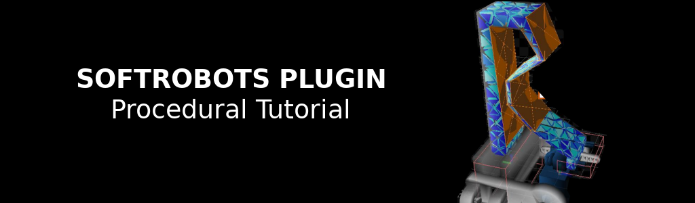

{ width=100% }

<script language="javascript">
function toggle(target) {
    d = document.getElementById(target);
    if(d.className === "show")
        d.className = "hide"
    else
        d.className = "show"
    return false;
}
</script>


## Context and objectives
In this hands on session, you are going to optimize the design a soft gripper. There exists many design of
soft grippers with different geometries and actuation strategies, such as tendons and pneumatic. For this
session, the general design of the gripper is as follows (see Figure 1). It is composed of 3 soft fingers that are
actuated by one servo-motor each. As a note, the structural components and the configurations of the
servomotors is the same as the Tripod robot (see Tuesday’s hands-on session). While the actuation is
given, the question is how to optimize the finger design to maximize the grasping performances while
satisfying size and fabrication constraints. The design specifications are as follows:

- Criterion to maximize: contact force between the object to grasp and the soft finger at
equilibrium
- Object to grasp: sphere of diameter 20 mm
- Servomotor: fixed angular displacement of 𝜋/6 rad
- Maximum dimensions of the finger: 80.0 x 50.0 x 20.0 mm
- Assembly on the servomotor: wall with thickness 5mm to be anchored on the motor arm and
pass-through M3 holes for the anchoring to the gripper base (see section Servomotor Assembly)
- Fabrication process: Fused Filament Deposit additive manufacturing, Prusa mk3 printer, Ninja
Flex material, extruder of diameter 0.4 mm, layer thickness of 0.3 mm.

The goal of this hands on session is to learn how to use parametric Computer Assisted Design (CAD) and
mechanical models to optimize the finger design iteratively. We propose in particular the use of a python
script that will automatically generate a geometry and a mesh, starting from a base finger design and
following simple inputs of design parameters. Participants who are already comfortable with soft
finger/robot design are free to propose their own CAD design of finger. Don’t hesitate to call the
session’s supervisors to discuss your designs! The fingers will be simulated using the mechanical FEM
model implemented in the SOFA software in order to have an evaluation of the grasping force. According
to the performances obtain, the participants will iterate manually on their design and repeat the process
until the design specifications are achieved.

Each participant will have to propose a design of finger at the end of the session, and justify their choice
by filling the form at the end of this document. The finger designs will be reviewed by the school
organizers, and the 3 of them will be 3D printed, assembled and tested.

## Requirements

### Python + Editor

The CAD generation script and the SOFA scene are both based on Python3 (version 3.7 or later). Despite any
text editor will work, we highly recommand the use of a dedicated IDE for python (pyCharm, Spyder, atom to cite few others).

### Gmsh
The python script interacts with Gmsh (by C. Geuzaine and J.-F. Remacle, version 4.9.5 or later) to
generate the volumes of the finger and discretize it with finite elements. To install it, execute the
following command in the Python terminal (http://gmsh.info).

```commandline
python3 -m pip install --upgrade gmsh
```

### SOFA
The mechanical model is implemented using SOFA (binaries of v22.06 with SoftRobots plugin). Please
refer to the hands on session of Monday and Tuesday for installation.

## Hands-on session starting directory
The starting directory for this hands on session is composed of several files and folders:
- A folder `Data` where the generated meshes are stored. The folder already contains the
servomotor meshes at the beginning
- Python scripts for the generation of the finger geometry and meshes:
  - `mesh_finger.py`
  - `mesh_clamping.py`
  - `mesh_contact_surface.py`
- A SOFA Python scene file and the utility python scripts that go with it
  - `procedural-finger.py`
  - `actuated_finger.py`
  - `elastic_material_object.py`
  - `actuated_arm.py`
  - `fixing_box.py`
  - `s90_servo.py`

## Parametric CAD

{ width=80% .center}

The starting design of soft finger we propose is described on Figure 1. The finger (in blue) consists initially in
a U-shape, composed of left, top and right walls. The base of the left wall is fixed to the servomotor arm
while the right wall is fixed to the gripper base. When actuated, the servomotor pushes on the left wall,
provoking the finger’s bending. How much the finger will bend for the fixed servomotor angular
displacement, and how much force it will apply on an object to grasp, depends on the finger geometry.
You have access to the following parameters to change this geometry.

| **Parameter** | **Description**                                                          |
|---------------|--------------------------------------------------------------------------|
| L             | Length                                                                   |
| l             | Width of the top wall                                                    |
| e1            | Thickness of the left wall at the finger top                             |
| e2            | Thickness of the top wall                                                |
| e3            | Thickness of the right wall                                              |
| n             | Number of intermediate points evenly spaced on the right wall            |
| d             | Distances between the intermediate points and the left wall (nx1 vector) |

From your choice of parameters, the python script `mesh_finger.py` generate the finger’s geometry and
the mesh elements the SOFA simulation needs. It first generates a series of points describing the contour
of the finger, then generate a surface from this contour and extrude it over a pre-defined finger
thickness (imposed here). Don’t hesitate to look at the commented code. Finally, the script generates
several files from this volume:

- A 3D mesh made of tetrahedron elements for computing the elastic behavior
- A 2D mesh of the finger’s envelope for its visualization on SOFA and the detection of collisions
- 2D meshes of the inner and outer surfaces for the detection and computation of collisions

The script also generates automatically the geometries we need to attach the finger on the servomotor.
Also, the script incorporate the maximum dimension specifications described above. Error messages will
pop in the prompt in case the desired finger is too big or some geometries cannot be generated.
To generate a new design of finger, you must:

- Choose a set of design parameters
- Write their value at the beginning of the code using your favorite code editor
- Execute the Python script using the command: `python3 mesh_finger.py`

The script will then automatically store the generated mesh files in the `Data` of the starting repository.
The script also opens a Gmsh window where you can see the finger and the final 3D mesh.
Note that the starting design we propose you to work with is not necessarily the best design nor the
most classical. There is today a vast library of finger and gripper designs in the soft robot community, and
finding the optimal one for a given grasping task is not trivial. The design presented here is simple
enough to give you some intuition about how the parameters influence the finger performances, but
other designs might work very well also. Don’t hesitate to discuss with the session supervisors about it!

## Servomotors assembly
{ width=80% }

## SOFA simulation
The SOFA scene used to evaluate the elastic behavior of the finger and the contact force with the object
to grasp is provided in the file `procedural-finger.py`. In this scene, we make use of the gripper symmetry
to reduce the overall computation time. As the three servomotors and fingers are at the same distance
to the object and equally distributed around it, they will apply the same force on it. Because of this, the
object is likely to stay approximately at the same location before and after grasping. Therefore, we
idealize the grasping scene by considering that the object is fixed in space and by simulating the behavior
of one finger only.

{ width=80% }

The scene contains:

<pre>
<a href="details/procedural-finger.py"> Try the scene in SOFA.</a>
<a href="javascript:void(0)" onclick="toggle('step1code');"> Show/Hide the code.</a>
</pre>
<div id='step1code' class='hide'>
```python
..autofile::procedural-finger.py
```
</div>

- The 3D mesh of the finger along with an elastic force field to simulate its deformation
- A box with rigidified mesh nodes at the left wall base, which pose is updated according to the
servomotor rotation
- A box of rigidified mesh nodes at the right wall base which pose is fixed
- A mesh of the object to grasp
- Collision models to account for eventual collisions between the finger and the object, and
between the inner surfaces of the left and right walls
- A SOFA controller to read user keyboard inputs and display the contact force

Don’t hesitate to go through the commented code of the SOFA scene for further details. To simulate the
finger behavior and determine the final contact force, you must:

- Launch the scene, by typing the following command in the terminal (for windows users, this
command works if runsofa.exe was previously included in the PATH environment variable) `runsofa tripod_gripper_CG.py`
- Press the Animate button. The servomotor is controlled to reach the angular displacement in 5s.
- Print the contact force in the terminal by pressing on the keys “Ctrl+P”. Make sure you activated
the visualization window of SOFA by clinking on it when you want to interact with the simulation.

To restart the simulation, press “Ctrl-R” (reload the scene) and then “Animate”.
Note that, in theory, only the final shape of the finger is important to us to evaluate the final contact
force. However, as the soft finger constitutes a non-linear elastic system, numerical solvers are likely to
diverge if the initial guess the user provides is too far from the actual solution. Therefore, computing
intermediate shapes of the finger during actuation improves numerical convergence.
Also, the value displayed in the terminal is the magnitude of the largest contact force applied on the
object. Just considering the magnitude will be enough for this hands-on session, but considering the
force direction or the localization of the contact might also be of interest for a gripper design. 

## Description brief of the soft finger design

### For participants using the base design
1. What design parameters did you finally select? What is the final contact force you obtain?
2. How did you choose the number of intermediate points on the right wall and the inter-wall
distances between those points?
3. How did you choose the left, upper and right walls thickness?
4. How do these thickness values comply with the fabrication constraints?
5. What challenges did you face during the design process? Think in particular to the minimal wall
thickness that can be fabricated.

### For participants proposing their own design
1. Add a 3D view and/or planar schematics (in different planes) of your finger. What is the final
contact force you obtain?
2. How did you choose the finger global geometry?
3. How did you choose the finger dimensions?
4. How does the design comply with the fabrication constraints?
5. What challenges did you face during the design process? Think in particular to the minimal wall
thickness that can be fabricated and the layer thickness.
