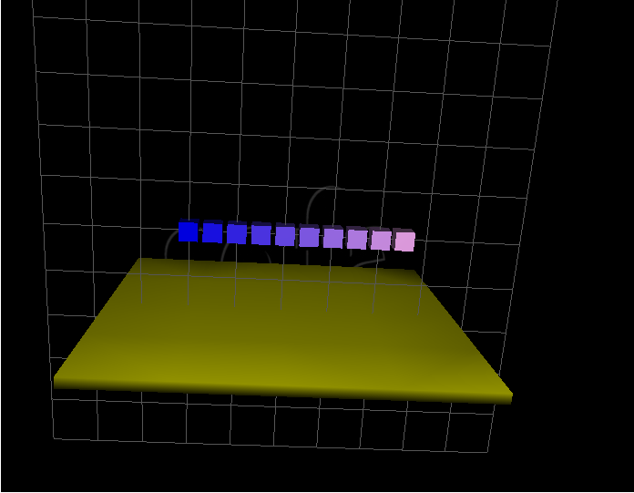

{width=100%}

<script language="javascript">
function toggle(target) {
    d = document.getElementById(target);
    if(d.className === "show")
        d.className = "hide"
    else 
        d.className = "show"
    return false;
}
</script>

<!-- dégager les ContactHeader sauf dernière étape -->

## First steps with Sofa & SoftRobots
Welcome in Sofa and the SoftRobots plugins. This tutorial is intended for people
who have never used Sofa, and aims at providing them quickly with the basis of scene modelling with Sofa.

This tutorial describes how to set up a simulation environment, a scene, using ..autolink::Sofa and how to use the
..autolink::STLIB plugin to add simulated elements.

Tutorials prequisites:

- installed ..autolink::Sofa with the ..autolink::STLIB.

- you have basic knowledge of the ..autolink::General::Python programming language. If not, you can go to ..autolink::General::PythonTutorials.

### Step 1: Loading a scene on Sofa

Sofa is loading the description of the simulation from *pyscn* files. Sofa is started with the command `runSofa`{.bash} in the terminal.  
To run a file `MyScene.pyscn`, use the command `cd`{.bash} to go to the file directory, and then type `runSofa MyScene.pyscn`{.bash}.  
In order to be able to send data to a connected robot, one way is to start Sofa with administrator rights, using the command `sudo`:  

```bash
sudo PATH_TO_BUILD_DIRECTORY/bin/runSofa PATH_TO_SCENE/MyScene.pyscn
```

### Step 2: Setting up a simple scene

####<i>At the end of this step, you will be able to:</i>
- Write a simple scene on Sofa using built-in objects called *prefabs* 
- Modify the properties of these objects
- Reload conveniently the scene after each modification

The content of the `pyscn` simulation files is in fact standard python code with at least one function named `createScene` taking a single parameter, the root of the scene hierarchy. This function is the entry point used by Sofa to fill the simulation's content and this is the place where you will type your scene's description.  
A scene is an ordered tree of nodes (example of node: gripper), with parent/child relationship (example of gripper's child: finger). Each node has one or more components. Every node and component has a name and a few features. The main node at the top of the tree is called "rootNode". Additional components can be added to the scene, that aren't nodes (they can't have children), related to the behaviour of the node (example: UniformMass for mass parameters definition or OGLModel for the settings of the graphic display). 

Making a very simple scene:
<div>
<pre>
<a href="details/step0.pyscn">  Try the scene in Sofa.</a>
<a href="myproject/firststeps.pyscn">  Write it yourself.</a>
<a href="javascript:void" onclick="toggle('step1code');">  Show/Hide the code.</a>
</pre>
<div id='step1code' class='hide'>
```python
from stlib.scene import ..autolink::STLIB::MainHeader, ..autolink::STLIB::ContactHeader
from stlib.visuals import ShowGrid
from stlib.physics.rigid import ..autolink::STLIB::Floor
from stlib.physics.rigid import ..autolink::STLIB::Cube

def createScene(rootNode):
    """This is my first scene"""
    ..autolink::STLIB::MainHeader(rootNode, gravity=[0.0,-981.0,0.0])
    ..autolink::STLIB::ContactHeader(rootNode, alarmDistance=15, contactDistance=10)

    ..autolink::STLIB::Floor(rootNode,
          translation=[0.0,-160.0,0.0],
          isAStaticObject=True)

    ..autolink::STLIB::Cube(rootNode,
          translation=[0.0,0.0,0.0],
          uniformScale=20.0)


    return rootNode
```
</div>
</div>

####<i>Remarks</i>
- The main node (rootNode) in this scene has two child nodes: Floor and Cube (the two physical objects present in the scene).
- The rootNode includes two behaviour descriptions: `MainHeader` (defining gravity as the main force exercised on the objects, assuming the length is in millimeters) and `ContactHeader` (stating how a contact beween the objects is handled: here the Cube mustn't be able to go through the floor). These behaviours apply to all its child nodes.
- Both the Cube and the Floor are built-in objects, which means that they are already implemented simulation models, including components and child nodes.

####<i>Exploring the scene</i>

- All scene codes can be modified: right click anywhere in the *Graph* panel of the Sofa GUI, and click on *Open file in editor* in the dropdown menu. The modifications need to be saved ([*Save*] button) before reloading the scene. 

- In order to reload the scene (after each modification of the code), press *Ctrl+R* or select *File \> Reload* in the menu bar.

- To automatically reload the scene when there are changes, add the option `-i` when first loading the scene in the terminal: `runSofa firststeps.pyscn -i`.

- In order to vizualize the properties of the objects directly from the GUI, double-click on the wanted item in the *Graph* panel to open the corresponding settings window. The properties can be modified directly from this window (click on the [*Update*] button to reload the scene with the new parameters afterwards).

You can try the following manipulations, in order to get familiar with Sofa environment:  
(Click on the text to Show/Hide the solution)

<div>
<pre>
<a href="javascript:void" onclick="toggle('step1exo');"> Change the position of the cube from the Sofa GUI</a>
<a href="javascript:void" onclick="toggle('step1exo2');"> Change the color of the cube, directly in the code</a>
</pre>
<div id='step1exo' class='hide'>
In the *Graph* panel on the left, unroll the 'Cube' Menu and double-click on 'MechanicalObject mstate'.  
In the window that appears, go to the *Transformation* tab: the line 'translation' allows you to move the object in the scene.
</div>
<div id='step1exo2' class='hide'>
After having opened the code file, add the `color` argument to the `Cube` object.  
The function becomes 
```python
Cube(rootNode,
      translation=[0.0,0.0,0.0],
      uniformScale=20.0,
      color=[0.0,0.0,1.0])
```  
The color vector is defined by percentages of [Red,Green,Blue].  
Don't forget to save and reload the scene.
</div>
</div>
<!-- ça marche, voir si on veut mettre le txt de la solution en forme ou pas-->


### Step 3: Building a Mechanical model for an object simulation & its Visual model
<!-- titre à revoir -->

####<i>At the end of this step, you will be able to:</i>
- Build a simple mechanical model of an object
- Build a corresponding visual object
- Add time integration and solving tools
- Understand the necessity for a collision management model


Both the Cube and the Floor objects used in Step 2 are actually built-in objects called *prefabs*. In the following steps, a deeper insight into Sofa's object modeling is provided. The next two steps aim at receating the *prefab* cube used in Step 2. (For a more dyamical scene, the Floor prefab is still present.) 
First of all, a mechanical model of the object is built. For the purpose of simulation, the object is discretized in space: it is divided into small volumes connected together by points (called nodes).  
The aim of the simulation is to compute, at each time step, the next position and velocity of each point of these nodes, based on the forces it is subjected to.  
Each of these points represents a degree of freedom (DOF) of the object. All the positions and velocities of these points are stored in what is called the *MechanicalObject*.

```python
cube.createObject('MechanicalObject', name, template, translation, rotation)
```  

The physical properties of the object material, like its mass distribution, are also implemented. 

```python
cube.createObject('UniformMass', name, mass=[totalMass, volume, inertiaMatrix[:]])
```

A time integration scheme is then added and defines the system to be solved at each time step of the simulation (here the implicit Euler Method). A solving method is in turn added (here the Conjugate Gradient mothod), that solves the equations governing the model at each time step, and updates the *MechanicalObject*.  
This model alone is enough to run the simulation of the cube's fall under gravity force. However, to be able to view it on screen, a visual model of the object must be created. This is one of the child nodes of the object. The virtual object is modeled with graphic vector: the volume of the object is, here again, discretized. The resulting set of points and their connections to each other (vectors) is called the *mesh*. The Figure below shows the initial mesh, composed of tetrahedra.
<figure>
  
  <figcaption>A view of the cube's mesh as described in the file <i>smCube27.obj</i></figcaption>
</figure>
At each time step, the *MechanicalObject* undergoes modifications (of its position, speed ...).  
Finally, in order to match the visual representation and the mechanical one, a mapping tool is implemented: it builds the correspondance between the points of the MechanicalObject and the nodes of the mesh.

<div>
<pre>
<a href="details/step3.pyscn"> Try the scene in Sofa.</a>
<a href="myproject/firststeps.pyscn"> Write it yourself.</a>
<a href="javascript:void" onclick="toggle('step3code');"> Show/Hide the code.</a>
</pre>
<div id='step3code' class='hide'>
```python
from stlib.scene import MainHeader
from stlib.visuals import ShowGrid
from stlib.solver import DefaultSolver
from stlib.physics.rigid import Floor

def createScene(rootNode):
  ShowGrid(rootNode)

  # A default gravity force is implemented on Sofa. Here we reset it, choosing millimeters as the length unit for the scene.
  MainHeader(rootNode, gravity=[0.0,-981.0,0.0])

  cube = rootNode.createChild("Cube")

  ### Mechanical model

  totalMass = 1.0
  volume = 1.0
  inertiaMatrix = [1.0, 0.0, 0.0, 0.0, 1.0, 0.0, 0.0, 0.0, 1.0]


  cube.createObject('MechanicalObject', name="DOF", template="Rigid", translation=[0.0,0.0,0.0], rotation=[0.0,0.0,0.0])
  cube.createObject('UniformMass', name="mass", mass=[totalMass, volume, inertiaMatrix[:]])

  # The following line defines the material behaviour when submitted to constraints; it is not necessary here, as no interaction between objects has been defined
  #cube.createObject('UncoupledConstraintCorrection')

  ### Time integration and solver

  cube.createObject('EulerImplicit', name='odesolver')
  cube.createObject('CGLinearSolver', name='Solver')


  ### Visual Object of the Cube

  visual = cube.createChild("Cube Visual")
  # Graphic model based on a mesh
  visual.createObject('OglModel', name="Visual", fileMesh="mesh/smCube27.obj", color=[0.1,0.0,1.0], scale=20.0)
  # Building a correspondance between the mechanical and the graphical representation
  visual.createObject('RigidMapping')

  ########################################
  ### Adding the Floor for more fun ;) ###
  Floor(rootNode,
          translation=[0.0,-160.0,0.0],
          uniformScale=5.0,
          isAStaticObject=True)


  return rootNode
```
</div>

####<i>Remarks</i>
- The points of the mesh are called nodes, but this term has nothing to do with the *nodes* of Sofa, related to the hierarchy of the objects.
- The objects we simulate here are rigid. The additional components describing the internal forces of deformable objects won't be discussed in this introduction tutorial.

####<i>Exploring the scene</i>
By clicking on the [*Animate*] button, the Cube can be seen endlessly falling, due to gravity forces. It even goes through the Floor as if it were a ghost. The reason for this behaviour is that the two objects of the scene (the Cube and the Floor) have been modeled separately. No line code refers to the behaviour to adopt when they collide.

<!--
Step1 is rather quick, it can be interesting to build a template for when several instances of an object are needed.  
Imagine that the expected scene is the following one:  
{width=70%}
<!-- à centrer 
All cubes are similar in size, only their color and position differ from one another. In order to build that rapidly, the same `Cube()` tamplate can be used several times with a variable parameter `c`, allowing to modify both the translation and the color of each cube by only changing `c`. A loop taking `c` as a parameter allows to generate the multiple instances of the *prefab*.

By clicking on the [Animate] button here, nothing changes on the scene. In order to make the cube fall on the Floor, as it would be expected for real cubes, Mechanical objects are needed.-->

### Step 4: Adding interactions between objects - collision modeling.

####<i>At the end of this step, you will be able to:</i>
- Add a collision model to the objects in a scene
- Understand the multi-model representation of the objects in Sofa

In order to make objects interact with each other, a *collision* model is required. 


### Step 5: Use *prefabs* to quickly model more complex scenes
<!-- CUBE CODE: plugins/STLIB/python/stlib/physics/rigid/rigidobject.py -->


<div>
<pre>
<a href="details/step5.pyscn"> Try the scene in Sofa.</a>
<a href="myproject/firststeps.pyscn"> Write it yourself.</a>
<a href="javascript:void" onclick="toggle('step3code');"> Show/Hide the code.</a>
</pre>
<div id='step3code' class='hide'>
  
<!-- a reecrire-->

</div>

