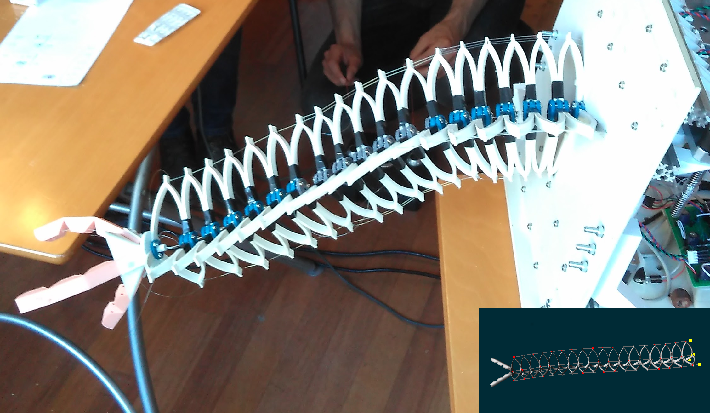

# Tendon Driven Soft Arm with Gripper

## Requirements

- [SOFA](https://github.com/sofa-framework/sofa)
- [SoftRobots](https://github.com/SofaDefrost/SoftRobots) plugin for SOFA
- [BeamAdapter](https://github.com/sofa-framework/BeamAdapter) plugin for SOFA
- [SofaPython3](https://github.com/sofa-framework/SofaPython3) plugin for SOFA

Binaries of SOFA with the above plugins are also available [here](https://github.com/sofa-framework/sofa/releases).

## Optional requirements 

If you want to you use the GUI to pilot the robot (forward kinematics) please install 
[tkinter for python3](https://riptutorial.com/tkinter/example/3206/installation-or-setup) and 
set `armGUI=True` in the file `params.py`

If you want to solve the inverse kinematics of the robot, you will need the SoftRobots.Inverse plugin which is 
distributed with the [binaries](https://github.com/sofa-framework/sofa/releases). Then in the file `params.py` set `inverse=True`.

