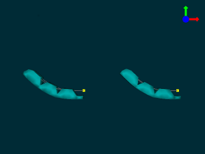

#Displacement vs. Force Control for Cables

In this scene we demonstrate how to use the _CableConstraint_ component to model an inelastic 1d cable. This cable is embedded in an elastic finger. The cable is free to slide through the material. You can either control the force applied by the cable or its displacement. If the force is controlled (for example, with a DC motor), the simulation will solve for the displacement that satisfies that force condition. If the displacement is controlled (for example, with a servo motor), the simulation will solve for the force that is required to obtain that displacement. The cable can only apply force in tension. By applying the same force or position command to fingers of different stiffness, we can see the difference in the behavior of the two types of commands. The stiffer finger moves less given the same force command than the softer finger, but for the displacement command, both actuators move the same amount.

To see the constraints move the finger, click animate, click in the visual display field, and press ctrl+ and ctrl-. This example uses a PythonScriptController.

<pre>

</pre>

