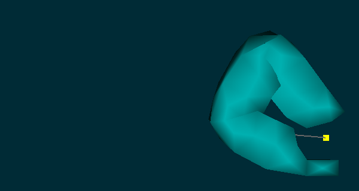
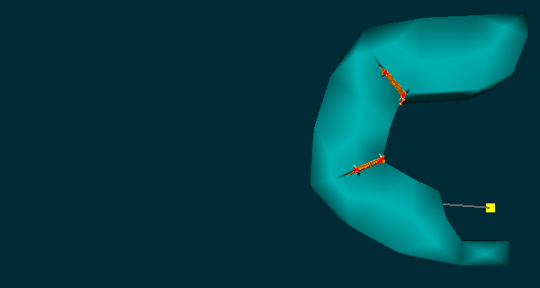

# Simulating a cable based soft gripper
This tutorial describes how to set up a simulation environment, a scene, using ..autolink::Sofa and how to use the
..autolink::SoftRobots plugin to model a virtual soft gripper driven by cables. The design of the gripper
we are going to model is from [Taimoor Hassan et al. ](https://dl.acm.org/citation.cfm?id=2977533).
Once modeled in Sofa the robot can be simulated and controlled as in:

<center><object style="width: 320px; height: 200px;" data="https://www.youtube.com/embed/9JOCe2pf34o?autoplay=0"> </object></center>


## Tutorials requirements:

- you have installed ..autolink::Sofa with the ..autolink::STLIB and
..autolink::SoftRobots plugins.

- you have basic knowledge of the ..autolink::General::Python programming language. If not you can go to ..autolink::General::PythonTutorials.

- you have basic knowledge of making scene with Sofa. If not, please complete the ..autolink::SoftRobots::Docs::FirstStep first.

## Step 0: Try the simulation in Sofa

Before continuing this tutorial try the resulting simulation you need to achieve.

You can load the scene directly from this documentation by clicking on the following:
<div>
<pre>
<a href="details/step0.py">  Try now the scene in Sofa.</a>
</pre>
</div>

Once loaded you can now click on the [Animate] button in the Sofa GUI and start interacting
in the 3D window. When your cursor have clicked on the 3D window you can control the
simulation to manipulate the gripper by pressing the following keys:

 - ctrl + *+* to close the gripper
 - ctrl + *-* to open the gripper
 - ctrl + *arrow up* to move it up
 - ctrl + *arrow down* to move it down
 - ctrl + *arrow left* to move it left
 - ctrl + *arrow right* to move it right

Note that with MacOS, you may have to use *cmd* instead of *ctrl*.

## Step 1: Setting up simple scene

Sofa is loading the description of the simulation from `.py` files. The content of these file is in fact standard python code with 
at least one function named *createScene* taking a single parameter, the root of the scene hierarchy. This function is the entry point used by Sofa
to fill the simulation's content and this is the place where you will type your scene's description. A scene is an ordered tree of nodes (ex:gripper.), with parent/child relationship (ex: finger). Each node has one or a few components. Every node and component has a name and a few features. The main node at the top of the tree is called `rootNode`.

A very simple scene may look like:
```python
from stlib3.physics.rigid import ..autolink::STLIB::Floor
from stlib3.physics.rigid import ..autolink::STLIB::Cube

def createScene(rootNode):
    """This is my first scene"""

    ..autolink::STLIB::Floor(rootNode,
          translation=[0.0,0.0,0.0],
          isAStaticObject=True)

    ..autolink::STLIB::Cube(rootNode,
          translation=[0.0,0.0,0.0])


    return rootNode
```
<div>
<pre>
<a href="details/step1.py"> Show me the result.</a>
<a href="myproject/cablegripper.py"> Do it yourself.</a>
</pre>
</div>

### <i>Comments (things to present or do in this step)</i>

- load `cablegripper.py` in sofa (with option '-i') and in your text editor

- add a floor and a cube in the scene

- show the scene graph structure and compare it with the content of the scene.

- move the floor so that it is -160 along they y Axis.


## Step 2: Modeling and simulating the gripper's finger deformations

We will now add a deformable object to a scene. There exists a lot of different mechanical behavior and
it is important to understand the one that approximates the behavior of the real object your want to simulate.
In particular, it is important to know how soft or stiff the material is, if it has an elastic or more complex 
behaviour (Hyperelastic, plastic, etc...). In our case, the real material is silicon which we will approximate 
with an elastic deformation law and simulate using the Finite Element Method (..autolink::General::FEM). In sofa, 
the ..autolink::STLIB::ElasticMaterialObject `from stlib3.physics.deformable` provides a scene template
to easily add such an object in your scene. 

To compute the deformation of the object using the Finite Element Method a volumetric representation of shape
must be provided. In our case we are using a tetrahedral mesh stored in a "vtk" file. In this tutorial we already
provide the appropriate tetrahedral mesh in a file name `finger.vtk`.

Let's now work in `finger.py`to add:
```python
from stlib3.physics.deformable import ..autolink::STLIB::ElasticMaterialObject

def Finger(parentNode=None, name="Finger",
           rotation=[0.0, 0.0, 0.0], translation=[0.0, 0.0, 0.0]):

    finger = Node(parentNode, name)
    eobject = ..autolink::STLIB::ElasticMaterialObject(finger,
                               volumeMeshFileName="data/mesh/finger.vtk",
                               poissonRatio=0.3,
                               youngModulus=18000,
                               totalMass=0.5,
                               surfaceColor=[0.0, 0.8, 0.7],
                               surfaceMeshFileName="data/mesh/finger.stl",
                               rotation=rotation,
                               translation=translation)

    return finger
```
<div>
<pre>
<a href="details/step2.py">  Show me the result.</a>
<a href="myproject/finger.py">  Do it yourself.</a>
</pre>
</div>

If you run the scene you can see the tetrahedral mesh with blue-ish element. To control the visualization
of this computation mesh you can either check the "Force Fields" option within the *View* panel in the runSofa GUI
or, as we did, change the `displayFlags` property of the ..autolink::Sofa::VisualStyle. In case you want to learn more
about volumetric mesh generation there is a dedicated tutorial called ..autolink::SoftRobots::Docs::MeshGeneration.

Still in the `finger.py` file we need to add a fixing box to avoid the free-falling the finger under
gravity. This can be done in the following way:

Let's now work in `finger.py` to add:
```python
from stlib3.physics.constraint import FixedBox

def Finger(parentNode=None, name="Finger",
           rotation=[0.0, 0.0, 0.0], translation=[0.0, 0.0, 0.0],
           fixingBox=[-10,-10,-10,10,10,10]):

    finger = ..autolink::STLIB::Node(parentNode, name)
    eobject = ..autolink::STLIB::ElasticMaterialObject(finger,
                               volumeMeshFileName="data/mesh/finger.vtk",
                               poissonRatio=0.3,
                               youngModulus=18000,
                               totalMass=0.5,
                               surfaceColor=[0.0, 0.8, 0.7],
                               surfaceMeshFileName="data/mesh/finger.stl",
                               rotation=rotation,
                               translation=translation)

    ..autolink::STLIB::FixedBox(eobject, atPositions=fixingBox,
                      doVisualization=True)

    return finger
```
<div>
<pre>
<a href="details/step2.2.py"> Show me the result.</a>
<a href="myproject/finger.py"> Do it yourself.</a>
</pre>
</div>

### <i>Comments (things to present or do in this step)</i>

- Load the file `finger.py` in runSofa and in your text editor.

- In `finger.py`, add an elastic object in a similar way to the one given in example 2.

- Gives a small explanation of how the arguments are passed. s

- Gives a small explanation of the role of the poisson ratio parameter. 

- Gives a small explanation of the role of the young modulus parameter. 

- Instead of displaying the tetrahedron mesh computational structure it is possible to wrap it into a visual model.
This visual model can be of much higher visual quality and is deformed according to the deformation of the underlying mechanical
mesh. To add such visual model you simply need to add `surfaceMeshFileName="data/mesh/finger.stl`
to the ..autolink::STLIB::ElasticMaterialObject template's arguments.

- In `finger.py` add a ..autolink::STLIB::FixedBox constraint to hold one of the finger extremities so that the object stops free-falling  because of gravity.
This should result in the following simulation:

- In `finger.py` forward the different arguments specifying the position of the finger to the `ElasticMaterialObject` and the `FixedBox`.


## Step 3: Actuating the finger with a cable

In the previous step, we showed how to add a finger shape object made of silicone rubber.
We will now actuate it using a 1d inelastic cable attached to the fingertip and passing through
the object geometry.

To model the cable you can use the ..autolink::SoftRobots::PullingCable template from
the ..autolink::SoftRobots plugin and use it in the following way:
```python
### ... similar to previous step ....
from softrobots.actuators import ..autolink::SoftRobots::PullingCable
from splib3.loaders import loadPointListFromFile

### ... similar to previous step ....
def Finger(parentNode):
    ### ... similar to previous step ....

    cable = ..autolink::SoftRobots::PullingCable(eobject, cableGeometry=loadPointListFromFile("data/mesh/cable.json"))
```

<div>
<pre>
<a href="details/step3.py">  Show me the result.</a>
<a href="myproject/finger.py">  Do it yourself.</a>
</pre>
</div>


The cable has rest length that can be changed interactively using a dedicated python object called 
a python script controller to connect key pressed on ctrl+ and ctrl- touch to a change of cable length.

You can create your own controllers by in-heriting from the `Sofa.Core.Controller` class and redefine
the `onKeypressedEvent` method. As in:
```python
import Sofa.Core
import Sofa.constants.Key as Key

class FingerController(Sofa.Core.Controller):
    def __init__(self, *args, **kwargs):
        Sofa.Core.Controller.__init__(self, args, kwargs)
        self.cable = args[0]
        self.name = "FingerController"

    def onKeypressedEvent(self, e):
        displacement = self.cable.CableConstraint.value[0]
        if e["key"] == Key.plus:
            displacement += 1.

        elif e["key"] == Key.minus:
            displacement -= 1.
            if displacement < 0:
                displacement = 0
        self.cable.CableConstraint.value = [displacement]
```

The controller can then be attached to the object *finger* it is supposed to control by doing:
```python
    # This creates a python script controller that permits to programmatically implement new behavior
    # or interactions using the Python programming language. 
    finger.addObject(FingerController(cable))
```

<div>
<pre>
<a href="details/step3.py">  Show me the result.</a>
<a href="myproject/finger.py">  Do it yourself.</a>
</pre>
</div>

### <i>Comments (things to present or do in this step) </i>

- In  `finger.py`, add the pulling cable to the finger as shown in the example.

- In `fingercontroller.py` show there is some print in the console indicating that the key is pressed.

- In `fingercontroller.py` add the code so that the cable length is changed on ky pressed with - and +. Implement
  the release of the cable when the key - is pressed.

## Step 4: Defining collision regions
By default, Sofa doesn't handle collision as they are very expensive to compute. To activate collisions you need to define specially
the geometries for which collisions are checked and how they are handled. This can be done by adding a dedicated
structure called a ..autolink::STLIB::CollisionMesh.  By default self-collision are not handled which,
if the object is strongly deformable leads some undesirable behaviors as illustrated in the figure below.




Additional ..autolink::STLIB::CollisionMesh are required to precisely define the self-collision
behavior.

The finger.py file should now contain :
```python
# ... Same imports as in step 3 ...
from stlib3.physics.collision import ..autolink::STLIB::CollisionMesh

# ... Same as in step 3 ...
def Finger(parentNode):
    # ... the finger
    # ... the cable..
    # ... the controller..

    ..autolink::STLIB::CollisionMesh(eobject,
         surfaceMeshFileName="data/mesh/finger.stl", name="part0", collisionGroup=1)


    ..autolink::STLIB::CollisionMesh(eobject,
             surfaceMeshFileName="data/mesh/fingerCollision_part1.stl", name="part1", collisionGroup=1)

    ..autolink::STLIB::CollisionMesh(eobject,
              surfaceMeshFileName="data/mesh/fingerCollision_part2.stl", name="part2", collisionGroup=2)
```
<div>
<pre>
<a href="details/step4.py"> Show me the result.</a>
<a href="myproject/finger.py"> Do it yourself.</a>
</pre>
</div>

The ..autolink::STLIB::CollisionMesh are set of triangles, each set can be part of one or multiple
collision group. By using the *"collisionGroup"* option you can specify the group of which the
..autolink::STLIB::CollisionMesh belong to. Triangle from different collision groupes are tested for 
intersections and contact handling.

### <i>Comments (things to present or do in this step)</i>

- Explain the import of the CollisionMesh (if it was not done before)

- Explain the load of the mesh...

- Explain the role of collision group. Object in two different groups can collide.

- Explain the contactDistance parameters


## Step 5: Duplicating the finger to make a complete gripper
Now we have a working single finger we can duplicate it so that it can match the original soft gripper
robot design that contains three of them.


At this point the `finger.py` file should contain something similar to:
```python
# -*- coding: utf-8 -*-
import Sofa.Core
import Sofa.constants.Key as Key
from stlib3.scene import ..autolink::STLIB::Node
from stlib3.physics.deformable import ..autolink::STLIB::ElasticMaterialObject
from stlib3.physics.constraints import ..autolink::STLIB::FixedBox
from stlib3.physics.collision import ..autolink::STLIB::CollisionMesh
from splib3.loaders import loadPointListFromFile
from softrobots.actuators import ..autolink::SoftRobots::PullingCable

class FingerController(Sofa.Core.Controller):
    def __init__(self, *args, **kwargs):
        Sofa.Core.Controller.__init__(self,args,kwargs)
        self.cable = args[0]
        self.name = "FingerController"

    def onKeypressedEvent(self, e):
        displacement = self.cable.CableConstraint.value[0]
        if e["key"] == Key.plus:
            displacement += 1.

        elif e["key"] == Key.minus:
            displacement -= 1.
            if displacement < 0:
                displacement = 0
        self.cable.CableConstraint.value = [displacement]

def Finger(parentNode=None, name="Finger",
           rotation=[0.0, 0.0, 0.0], translation=[0.0, 0.0, 0.0],
           fixingBox=[-10.0,-10.0,-10.0,10.0,10.0,10.0], pullPointLocation=[0.0,0.0,0.0]):

    finger = ..autolink::STLIB::Node(parentNode, name)
    eobject = ..autolink::STLIB::ElasticMaterialObject(finger,
                                   volumeMeshFileName="data/mesh/finger.vtk",
                                   poissonRatio=0.3,
                                   youngModulus=100,
                                   totalMass=0.5,
                                   surfaceColor=[0.0, 0.8, 0.7],
                                   surfaceMeshFileName="data/mesh/finger.stl",
                                   rotation=rotation,
                                   translation=translation)

    ..autolink::STLIB::FixedBox(eobject, atPositions=fixingBox, doVisualization=True)

    cable=..autolink::SoftRobots::PullingCable(eobject,
                 "PullingCable",
                 pullPointLocation=pullPointLocation,
                 rotation=rotation,
                 translation=translation,
                 cableGeometry=loadPointListFromFile("data/mesh/cable.json"));

    FingerController(eobject, cable)

    ..autolink::STLIB::CollisionMesh(eobject, name="CollisionMesh",
                 surfaceMeshFileName="data/mesh/finger.stl",
                 rotation=rotation, translation=translation,
                 collisionGroup=[1, 2])

    ..autolink::STLIB::CollisionMesh(eobject, name="CollisionMeshAuto1",
                 surfaceMeshFileName="data/mesh/fingerCollision_part1.stl",
                 rotation=rotation, translation=translation,
                 collisionGroup=[1])

    ..autolink::STLIB::CollisionMesh(eobject, name="CollisionMeshAuto2",
                 surfaceMeshFileName="data/mesh/fingerCollision_part2.stl",
                 rotation=rotation, translation=translation,
                 collisionGroup=[2])


    return finger
```

The file `gripper.py` should contain:
```python
from grippercontroller import GripperController
from finger import Finger

def Gripper(parentNode=None):
    selfNode = parentNode.createChild("Gripper")

    f1 = Finger(selfNode, "Finger1",
           rotation=[0, 0, 105],
           translation=[20.0,0.0, 0.0],
           fixingBox=[-20, -10, 0, 20, 10, 15],
           pullPointLocation=[3, 10.5, 3])

    f2 = Finger(selfNode, "Finger2",
           rotation=[180, 0, 65],
           translation=[-10.0,0.0, -4.0],
           fixingBox=[-20, -10, -30, 20, 10, 0],
           pullPointLocation=[3, 10.5, -7])

    f3 = Finger(selfNode, "Finger3",
           rotation=[180, 0, 65],
           translation=[-10.0,0.0, 34.0],
           fixingBox=[-20, -10, 0, 20, 10, 50],
           pullPointLocation=[3, 10.5, 31.5])

    GripperController(selfNode, [f1,f2,f3])

    return selfNode
```
<div>
<pre>
<a href="details/step5.py"> Show me the result.</a>
<a href="myproject/gripper.py"> Do it yourself.</a>
</pre>
</div>

### <i>Comments (things to present or do in this step)</i>

- In `gripper.py`, show how to add one finger at default position and location. Do not forget that you can start Sofa
with the -i option for an automatic reload of the gripper.py each time the source file is changed.

- In `gripper.py`, duplicate the Finger object and change the location, orientation and fixing point so that it match
the desired robot geometry of the gripper. Do not forget that you can start Sofa with the -i option for an automatic
reload of the gripper.py each time the source file is changed.

- Attach the GripperController to the Gripper object. So that when you press CTRL+UP/DOWN/LEFT/RIGHT the gripper is moving.


## Step 6: Putting everything in a single simulation.


Open the `cablegripper.py` and add the Cube, the Floor and the Gripper which should result in something similar to:

```python
from stlib3.scene import ..autolink::STLIB::MainHeader, ..autolink::STLIB::ContactHeader
from stlib3.physics.rigid import ..autolink::STLIB::Floor, ..autolink::STLIB::Cube
from gripper import Gripper

def createScene(rootNode):
    """This is my first scene"""
    ..autolink::STLIB::MainHeader(rootNode, gravity=[0.0, -981.0, 0.0], plugins=["SoftRobots"])
    ..autolink::STLIB::ContactHeader(rootNode, alarmDistance=4, contactDistance=3, frictionCoef=0.08)

    Gripper(rootNode)

    ..autolink::STLIB::Floor(rootNode, name="Floor",
          color=[1.0,0.0,0.0,1.0],
          translation=[0.0,-160.0,0.0],
          isAStaticObject=True)

    ..autolink::STLIB::Cube(rootNode, name="Cube",
          uniformScale=20.0,
          color=[1.0,1.0,0.0,1.0],
          totalMass=0.03,
          volume=20,
          inertiaMatrix=[1000.0,0.0,0.0,0.0,1000.0,0.0,0.0,0.0,1000.0],
          translation=[0.0,-130.0,10.0])

    return rootNode
```
<div>
<pre>
<a href="details/step6.py">  Show me the result.</a>
<a href="myproject/cablegripper.py">  Do it yourself.</a>
</pre>
</div>


## Conclusion
Congratulation, you have completed this tutorial. You are strongly encouraged to pursue with the other tutorial and 
read the thematical documentations.

If you have any comments or suggestions, please submit issues on our ..autolink::github/SoftRobots page. 
