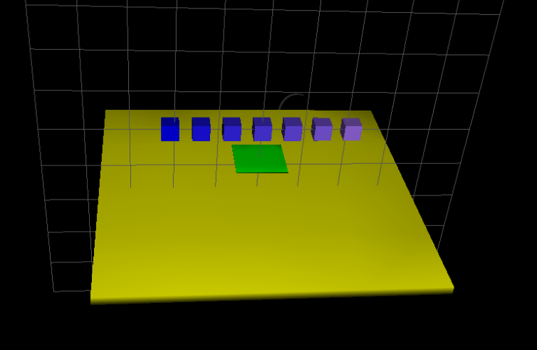

{width=100%}

<script language="javascript">
function toggle(target) {
    d = document.getElementById(target);
    if(d.className === "show")
        d.className = "hide"
    else 
        d.className = "show"
    return false;
}
</script>


## First steps with Sofa & SoftRobots
Welcome to Sofa and the SoftRobots plugins. This tutorial is intended for people
who have never used Sofa, and aims at providing them quickly with the basis of scene modelling with Sofa.

This tutorial describes how to set up a simulation environment, a scene, using ..autolink::Sofa and how to use the Sofa Template Library
..autolink::STLIB to add simulated elements.

Tutorials prequisites:

- ..autolink::Sofa and the library ..autolink::STLIB are installed.

- you have basic knowledge of the ..autolink::General::Python programming language. If not, you can go to ..autolink::General::PythonTutorials.

<!-- ### Step 1: Loading a scene on Sofa

Sofa is loading the description of the simulation from *.py* files. Sofa is started with the command `runSofa`{.bash} in the terminal.  
To run a file `MyScene.py`, use the following command:

```bash
PATH_TO_SOFA_DIRECTORY/build/bin/runSofa PATH_TO_SCENE_FILE/MyScene.py
```
In order to be able to send data to a connected robot, one way is to start Sofa with administrator rights, using the command `sudo` (it requires the administrator password):  

```bash
sudo PATH_TO_BUILD_DIRECTORY/bin/runSofa PATH_TO_SCENE/MyScene.py
```
-->

### Step 1: Setting up a simple scene

####<i>At the end of this step, you will be able to:</i>
- Write a simple scene in Sofa using built-in objects called *prefabs* (or *templates*)
- Modify the properties of these objects
- Conveniently reload the scene after each modification

The content of the `.py` simulation files is in fact standard python code with at least one function named `createScene` taking a single parameter, the root of the scene hierarchy. This function is the entry point used by Sofa to fill the simulation's content and this is the place where you will type your scene's description.
A scene is an ordered tree of nodes, representing objects (example of node: hand), with parent/child relationship (example of hand's child: finger). Each node has one or more components. Every node and component has a name and a few features. The main node at the top of the tree is called "rootNode". Additional components can be added to the scene, that aren't nodes (they cannot have children), related to the behaviour of the object (examples: *UniformMass* for vertexMass parameters definition, and *OGLModel* for the settings of the graphic display). 

Making a very simple scene:
<div>
<pre>
<a href="details/step1.py">  Try the scene in Sofa.</a>
<a href="myproject/mystep1.py">  Write it yourself.</a>
<a href="javascript:void(0)" onclick="toggle('step1code');">  Show/Hide the code.</a>
</pre>
<div id='step1code' class='hide'>
```python
from stlib3.scene import ..autolink::STLIB::MainHeader, ..autolink::STLIB::ContactHeader
from stlib3.visuals import ShowGrid
from stlib3.physics.rigid import ..autolink::STLIB::Floor
from stlib3.physics.rigid import ..autolink::STLIB::Cube

def createScene(rootNode):
    """This is my first scene"""
    ..autolink::STLIB::MainHeader(rootNode, gravity=[0.0,-981.0,0.0])
    ..autolink::STLIB::ContactHeader(rootNode, alarmDistance=15, contactDistance=10)

    ..autolink::STLIB::Floor(rootNode,
          translation=[0.0,-160.0,0.0],
          isAStaticObject=True)

    ..autolink::STLIB::Cube(rootNode,
          translation=[0.0,0.0,0.0],
          uniformScale=20.0)


    return rootNode
```
</div>
</div>

####<i>Remarks</i>
- Two nodes are attached to the main node (rootNode) in this scene: Floor and Cube (the two physical objects present in the scene).
- The rootNode includes two behaviour descriptions: `MainHeader` (defining gravity as the main force exercised on the objects, assuming the length is in centimeters) and `ContactHeader` (stating how a contact between the objects is handled: here the objects must not be able to go through one another). As I have defined them in the rootNode, these behaviours apply to all the nodes attached to it.
- Both the Cube and the Floor are built-in objects, *prefabs*, which means that they are already implemented simulation models, including components and child nodes.

####<i>Exploring the scene</i>

- The [*Animate*] button allows to start and stop playing the scene.

- All scene codes can be modified: right click anywhere in the *Graph* panel of the Sofa GUI, and click on *Open file in editor* in the dropdown menu. The modifications need to be saved ([*Save*] button) before reloading the scene. 

- In order to reload the scene (after each modification of the code), press *Ctrl+R* or select *File \> Reload* in the menu bar.

- To automatically reload the scene when there are changes, add the option `-i` when first loading the scene in the terminal: `runSofa firststeps.py -i`{.bash}.

- In order to vizualize the properties of the objects directly from the GUI, double-click on the wanted item in the *Graph* panel to open the corresponding settings window. The properties can be modified directly from this window (click on the [*Update*] button to reload the scene with the new parameters afterwards).

You can try the following manipulations, in order to get familiar with Sofa environment:  
(Click on the text to Show/Hide the solution)

<div>
<pre>
<a href="javascript:void(0)" onclick="toggle('step1exo');"> Change the position of the cube from the Sofa GUI</a>
<a href="javascript:void(0)" onclick="toggle('step1exo2');"> Change the color of the cube, directly in the code</a>
</pre>
<div id='step1exo' class='hide'>
In the *Graph* panel on the left, expand the 'Cube' menu and double-click on 'MechanicalObject mstate'.  
In the window that appears, go to the *Transformation* tab: the line 'translation' allows you to move the object in the scene.  
Such changes don't modify the code of the scene, and are only kept in memory as long as the scene is running.
</div>
<div id='step1exo2' class='hide'>
After having opened the code file, add the `color` argument to the `Cube` object.  
The function becomes 
```python
Cube(rootNode,
      translation=[0.0,0.0,0.0],
      uniformScale=20.0,
      color=[0.0,0.0,1.0,1.0])
```  
The color vector is defined by percentages of [Red,Green,Blue].  
Don't forget to save and reload the scene.
</div>
</div>
<!-- ca marche, voir si on veut mettre le txt de la solution en forme ou pas-->


### Step 2: Building a Mechanical model for an object simulation & its Visual model

####<i>At the end of this step, you will be able to:</i>
- Build a simple mechanical model for a rigid object
- Build a corresponding visual object
- Add time integration and solving tools
- Understand the necessity for a collision management model


Both the Cube and the Floor objects used in Step 2 are actually built-in objects called *prefabs*. In the following steps, a deeper insight into Sofa's rigid  object modeling is provided. The next two steps aim at recreating the *prefab* Cube used in Step 2. (For a more dynamic scene, the Floor prefab is still present.)  
The node Cube is defined and attached to the rootNode with the function `node.createChild()`.  
In the particular case where the simulated object is rigid, like here, all of its points are moving together. This means that studying the movement of a single point - usually the center of gravity - is equivalent to studying the movement of all the points. The aim of the simulation is to compute, at each time step, the next position and velocity of this gravity center, based on the forces it is subjected to. The center of gravity can move in the three directions of space and rotate around these three axes. This means that it has 6 degrees of freedom (DOFs). All the positions and velocities that are computed are stored in what is called the *MechanicalObject*. The different objects of the Cube are added via the function `node.createObject()`.

```python
cube.createObject('MechanicalObject', name, template, translation, rotation)
```  

The physical properties of the object material, like its vertexMass distribution, are also implemented. 

```python
cube.createObject('UniformMass', name, vertexMass=[totalMass, volume, inertiaMatrix[:]])
```

A time integration scheme is then added and defines the system to be solved at each time step of the simulation (here the implicit Euler Method). A solving method is in turn added (here the Conjugate Gradient method), that solves the equations governing the model at each time step, and updates the *MechanicalObject*.  

This model alone is enough to run the simulation of the Cube's fall under gravity force. However, to be able to view it on screen, a visual model of the object must be created. The visual model is defined in a new node. The virtual object is modeled with graphic vectors: the surface of the object is discretized, that is divided into small surface elements connected together by points (called nodes). The resulting set of points and their connections to each other (vectors) is called the *mesh*. Figure 1 below shows the initial mesh for the visual model: the outer surface of the cube has been split into triangular elements.
<figure>
  
  <figcaption>Figure 1: A view of the cube's mesh for the visual model as described in the file <i>smCube27.obj</i></figcaption>
</figure>
At each time step, the *MechanicalObject* undergoes modifications (of its position, speed ...).  
Finally, in order to have the visual representation moving along with the mechanical one, a mapping tool is implemented: it builds the correspondance between the properties of the MechanicalObject (translation, rotation, velocity) and the nodes of the mesh.

<div>
<pre>
<a href="details/step2.py"> Try the scene in Sofa.</a>
<a href="myproject/mystep2.py"> Write it yourself.</a>
<a href="javascript:void(0)" onclick="toggle('step2code');"> Show/Hide the code.</a>
</pre>
<div id='step2code' class='hide'>
```python
from stlib3.scene import MainHeader
from stlib3.visuals import ShowGrid
from stlib3.solver import DefaultSolver
from stlib3.physics.rigid import Floor

def createScene(rootNode):
  ShowGrid(rootNode)

  # A default gravity force is implemented on Sofa. Here we reset it, choosing millimeters as the length unit for the scene.
  MainHeader(rootNode, gravity=[0.0,-981.0,0.0])

  cube = rootNode.createChild("Cube")

  ### Mechanical model

  totalMass = 1.0
  volume = 1.0
  inertiaMatrix = [1.0, 0.0, 0.0, 0.0, 1.0, 0.0, 0.0, 0.0, 1.0]


  cube.createObject('MechanicalObject', name="DOF", template="Rigid3", translation=[0.0,0.0,0.0], rotation=[0.0,0.0,0.0])
  cube.createObject('UniformMass', name="vertexMass", vertexMass=[totalMass, volume, inertiaMatrix[:]])

  # The following line defines the material behaviour when submitted to constraints; it is not necessary in this step, as no interaction between objects has been defined
  #cube.createObject('UncoupledConstraintCorrection')

  ### Time integration and solver

  cube.createObject('EulerImplicit', name='odesolver')
  cube.createObject('CGLinearSolver', name='Solver')


  ### Visual Object of the Cube

  visual = cube.createChild("CubeVisual")
  # Graphic model based on a mesh
  visual.createObject('OglModel', name="Visual", fileMesh="mesh/smCube27.obj", color=[0.1,0.0,1.0], scale=20.0)
  # Building a correspondance between the mechanical and the graphical representation
  visual.createObject('RigidMapping')

  ########################################
  ### Adding the Floor for more fun ;) ###
  Floor(rootNode,
          translation=[0.0,-300.0,0.0],
          uniformScale=5.0,
          isAStaticObject=True)


  return rootNode
```
</div>
</div>

####<i>Remarks</i>
- The points of the mesh are called nodes, but this term has nothing to do with the *nodes* of Sofa, related to the hierarchy of the objects.
- The objects simulated in this tutorial are rigid. The additional components describing the internal forces of deformable objects will not be discussed in this introduction tutorial.

####<i>Exploring the scene</i>
By clicking on the [*Animate*] button, the Cube can be seen falling endlessly, due to gravity force. It even goes through the Floor as if it were a ghost. The reason for this behaviour is that the two objects of the scene (the Cube and the Floor) have been modeled separately. No line code refers to the behaviour to adopt when they collide.


### Step 3: Adding interactions between objects - collision modeling.

####<i>At the end of this step, you will be able to:</i>
- Add a collision model to the objects in a scene
- Understand the multi-model representation of the objects in Sofa

In order to make objects interact with each other, a *collision* model is required. The collision model is another child node of the Cube. Collisions are handled with yet another MechanicalObject representing the Cube, and specifications on how the Cube should react to a contact: here the contact is stopping it from moving further. This is implemented with the following line from Step 2, now uncommented:

```python
cube.createObject('UncoupledConstraintCorrection')
```

The constraints of the collision apply on the surface on the Cube. In our discretized representation of the cube, its outer surface is decomposed into triangular elements, and also shows some line elements and points. They represent the degrees of freedom of the collision model. The surface mesh is described based on the one used in the Visual model. 
In addition to a collision model, it is necessary to describe the rules  of collision detection, and how they are handled when they occur. This is what the `ContactHeader` object is doing. As the rules apply for all the objects in the scene, it is positionned in the rootNode. Here the rules are as follows: potential collisions are looked for within an `AlarmDistance` radius from the objet. If a collision situation is detected, the collision model computes the behaviour of the objects, which are stopped at a `ContactDistance` from each other.  
Finally, in order to map those collision DOFs with those of the mechanical model, a `RigidMapping` is used here as well.  

<div>
<pre>
<a href="details/step3.py"> Try the scene in Sofa.</a>
<a href="myproject/mystep3.py"> Write it yourself.</a>
<a href="javascript:void(0)" onclick="toggle('step3code');"> Show/Hide the code.</a>
</pre>
<div id='step3code' class='hide'>
```python  
from stlib3.scene import MainHeader, ContactHeader
from stlib3.visuals import ShowGrid
from stlib3.solver import DefaultSolver
from stlib3.physics.rigid import Floor

def createScene(rootNode):
  ShowGrid(rootNode)

  # A default gravity force is implemented on Sofa. Here we reset it, choosing millimeters as the length unit for the scene.
  MainHeader(rootNode, gravity=[0.0,-981.0,0.0])

  #Collision handling built-in function (already used in Step 1)
  ContactHeader(rootNode, alarmDistance=10, contactDistance=5)

  cube = rootNode.createChild("Cube")

  ### Mechanical model

  totalMass = 1.0
  volume = 1.0
  inertiaMatrix = [1.0, 0.0, 0.0, 0.0, 1.0, 0.0, 0.0, 0.0, 1.0]


  cube.createObject('MechanicalObject', name="DOF", template="Rigid3", translation=[0.0,0.0,0.0], rotation=[0.0,0.0,0.0])
  cube.createObject('UniformMass', name="vertexMass", vertexMass=[totalMass, volume, inertiaMatrix[:]])

  # Material behaviour when submitted to constraints
  cube.createObject('UncoupledConstraintCorrection')

  ### Time integration and solver

  cube.createObject('EulerImplicit', name='odesolver')
  cube.createObject('CGLinearSolver', name='Solver')


  ### Visual Object of the Cube

  visual = cube.createChild("CubeVisual")
  # Graphic model based on a mesh
  visual.createObject('OglModel', name="Visual", fileMesh="mesh/smCube27.obj", color=[0.1,0.0,1.0], scale=20.0)
  # Building a correspondance between the mechanical and the graphical representation
  visual.createObject('RigidMapping')

  ### Collision Object for the Cube

  collision = cube.createChild("CubeCollisionModel")
  collision.createObject('MeshObjLoader', name="loader", filename="mesh/smCube27.obj", triangulate="true", scale=20.0)

  collision.createObject('Mesh', src="@loader")
  collision.createObject('MechanicalObject')

  collision.createObject('Triangle')
  collision.createObject('Line')
  collision.createObject('Point')

  collision.createObject('RigidMapping')


  ########################################
  ### Adding the Floor for more fun ;) ###
  floor = Floor(rootNode,
      name="Floor",
          translation=[0.0,-300.0,0.0],
          uniformScale=5.0,
          isAStaticObject=True)


  return rootNode
```
</div>
</div>

####<i>Exploring the scene</i>
- Thanks to the collision model, the Cube's fall is now stopped by the Floor.  
- With the addition of the collision model, there are now three representations of the same Cube object: a mechanical one, a visual one, and a collision model representation (see Figure 2 below). This multi-model representation is characteristic of Sofa, along with the mapping functions to build correspondance between the representations.
<figure>
  
  <figcaption>Figure 2: Multi-modal representation of the cube</i></figcaption>
</figure>  
- These representations are accessible via the *View* panel of the Sofa GUI, in which you can switch between those you want to display.


####<i>Remarks</i>
- The code that was built in the last two steps in order to implement the Cube model constitutes the `Cube()` prefab. Such prefab objects allow great time savings, and a lighter code.  
- The same collision model is also implemented by default in the Floor prefab.  
- By zooming in the simulation window (scroll the mouse wheel), a small gap can be observed between the cube and the floor: it corresponds to the `ContactDistance` at which the cube is stoppped from the floor. Because the time is discretized, it is important not to assign too small a value to the `AlarmDistance`; otherwise the risk is that, from an instant to the next one that is computed, the objects have already entered collision, in which case the collision would not be computed correctly.

### Step 4: Use *prefabs* to quickly model more complex scenes

####<i>At the end of this step, you will be able to:</i>
- Build a more complex scene with prefabs
- Use a loop structure to build several instances of the same object

Based on the prefab object `Cube()` and `Foor()`, as well as the collision management function `ContactHeader()`, the aim of this step is to build rapidly the scene on Figure 3 below:  
<figure>
  
  <figcaption>Figure 3: Initial view of the simulation</i></figcaption>
</figure>

<div>
<pre>
<a href="details/step4.py"> Try the scene in Sofa.</a>
<a href="myproject/mystep4.py"> Write it yourself.</a>
<a href="javascript:void(0)" onclick="toggle('step4code');"> Show/Hide the code.</a>
</pre>
<div id='step4code' class='hide'>
```python  
from stlib3.scene import MainHeader, ContactHeader
from stlib3.visuals import ShowGrid
from stlib3.physics.rigid import Floor
from stlib3.physics.rigid import Cube

def createScene(rootNode):
    """This is my first scene"""
    MainHeader(rootNode, gravity=[0.0,-981.0,0.0])
    ContactHeader(rootNode, alarmDistance=8, contactDistance=5)

    ShowGrid(rootNode)

    Floor(rootNode,
          translation=[0.0,-160.0,0.0],
          uniformScale=5.0,
          isAStaticObject=True)
    
    Floor(rootNode,
           name="FloorObstacle",
             translation=[0.0,-80.0,0.0],
             color=[0.0,1.0,0.0,1.0],
             uniformScale=0.8,
             isAStaticObject=True)

    for c in range(7):
        Cube(rootNode,
       name="Cube"+str(-210+c*70),
             translation=[-210+c*70,0.0,0.0],
             color=[c/10.0,c*0.7/10.0,0.9,1.0],
             uniformScale=20.0)


    return rootNode
```
</div>
</div>

####<i>Exploring the scene</i>
- All seven cubes are similar in size and two of their coordinates are identical. A variable `c` is defined, in order to modify the translation parameter and the color of each cube. By using a loop structure, the Cube prefab function can be written only once.
- The collision model of this scene is more complex: collisions are possible between the cubes, between the central cubes and the intermediate green floor, and finally between the cubes and the yellow floor. The function `ContactHeader` applies to all the nodes attached to the rootNode, governing the whole collision possibilities with one call of the function in the rootNode.  

### Conclusion
Congratulations, you completed this tutorial! You are strongly encouraged to pursue with the other tutorials and read the thematical documentations.

If you have any questions or suggestions, please submit them on our github/SoftRobots page.
