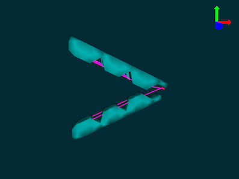
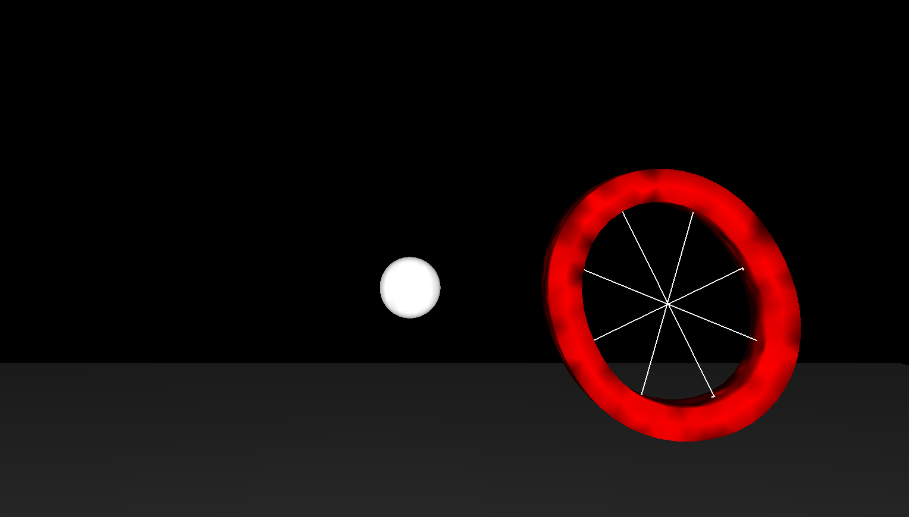
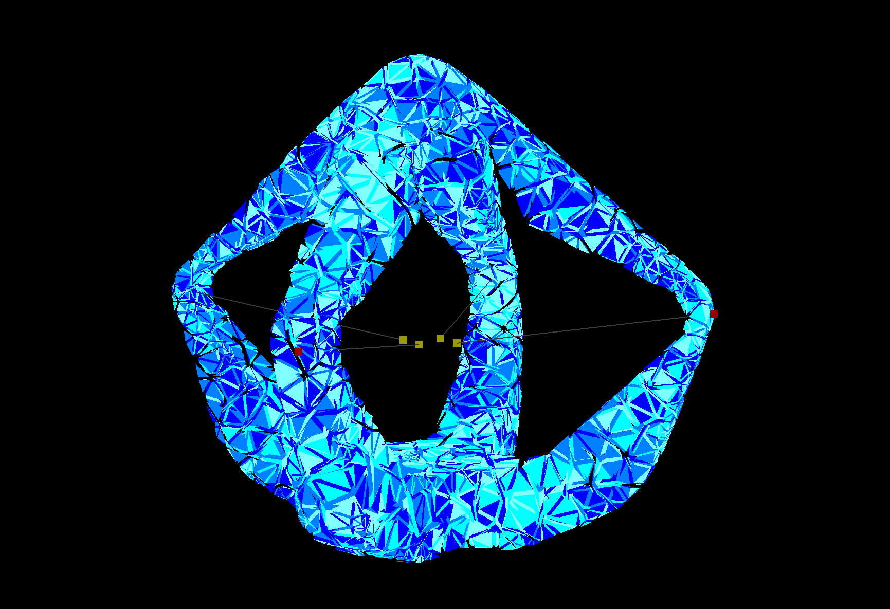
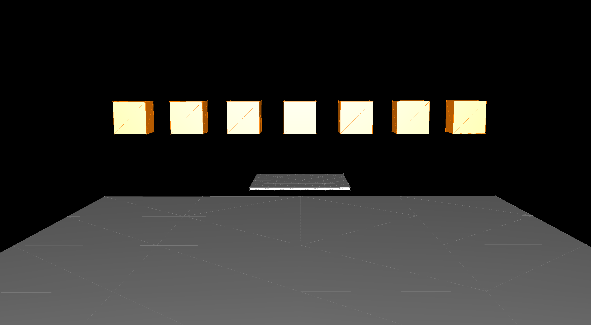
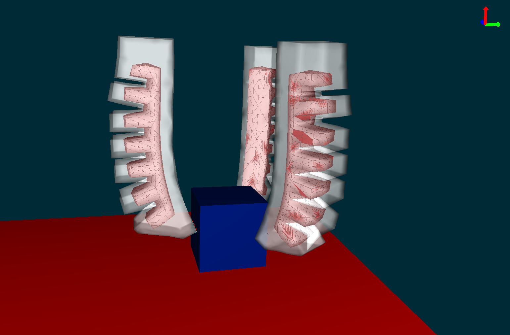
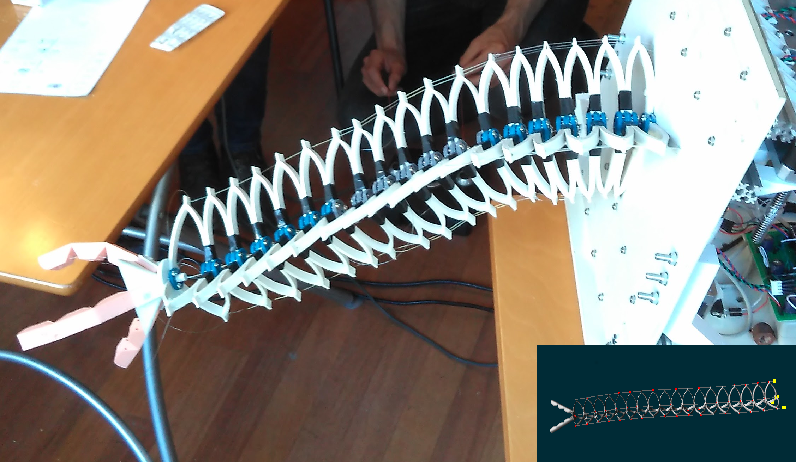
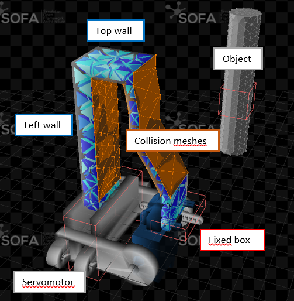
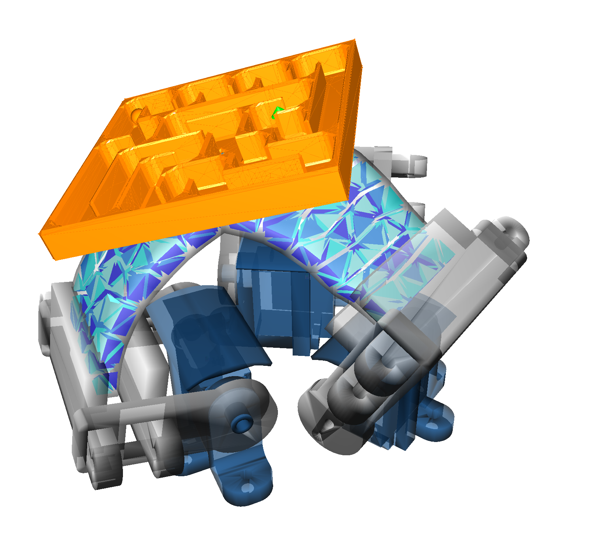
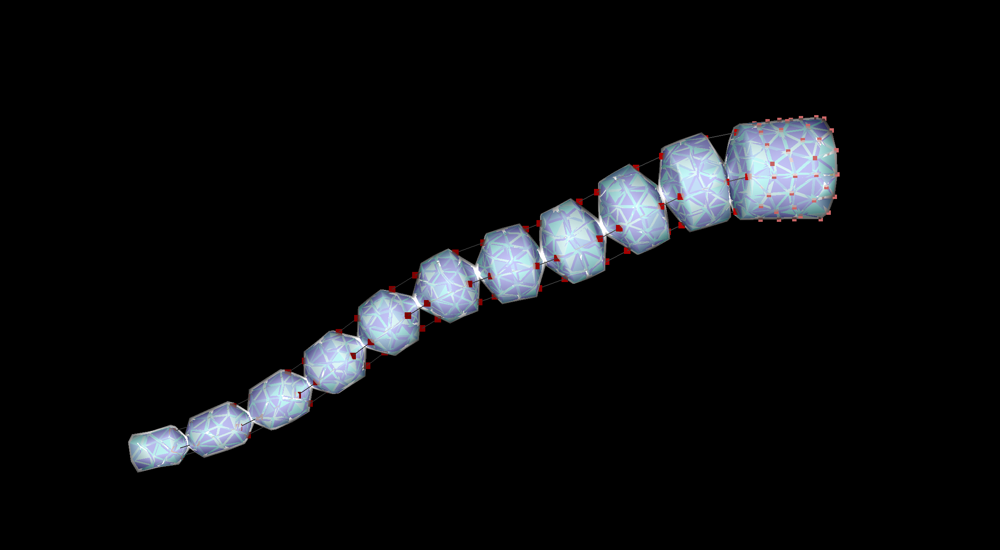

# Tutorials

|  |  |  |   
|:------------------------------------:|:-------------------------------------------:|:-----------------------------------------:|
|           **CableGripper**           |              **CircularRobot**              |             **DiamondRobot**              |   

|  |  |  |   
|:--------------------------------:|:--------------------------------------------------------:|:---------------------------------------------:|
|          **FirstSteps**          |                    **PneunetGripper**                    |              **SoftArmGripper**               |   

|  |  |  |   
|:-------------------------------------------:|:---------------------------------------------:|:---------------------------:|
|            **SoftFingerDesign**             |                  **Tripod**                   |          **Trunk**          |   
