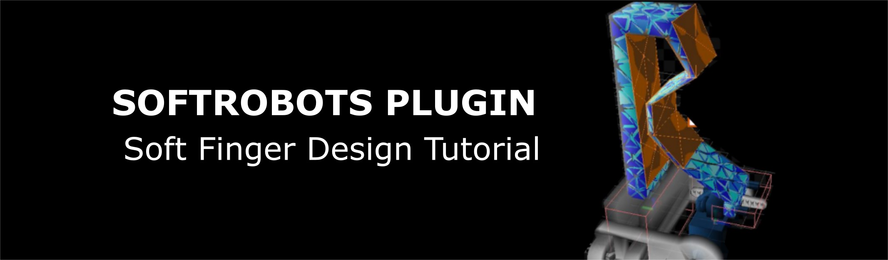
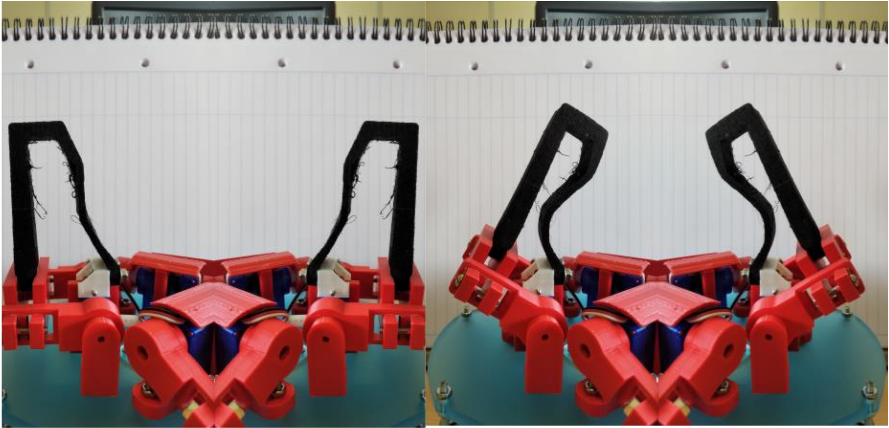
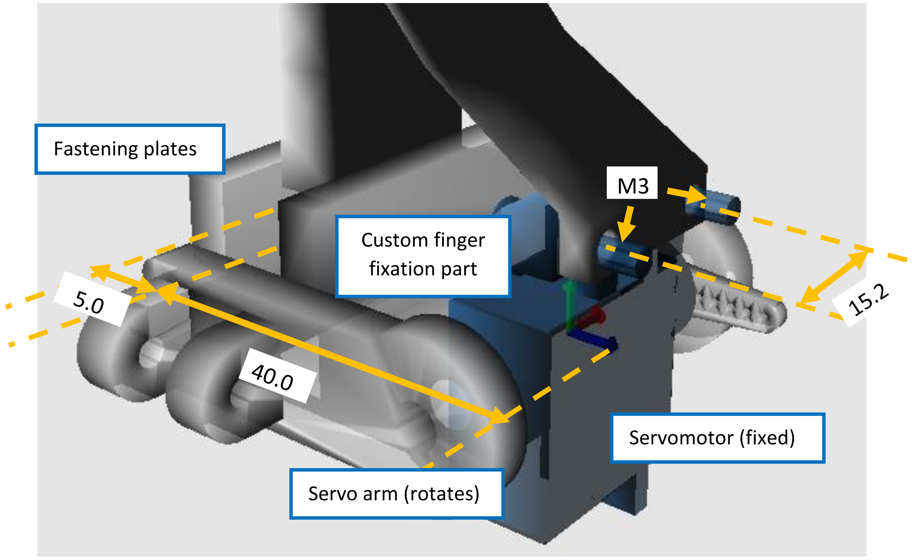
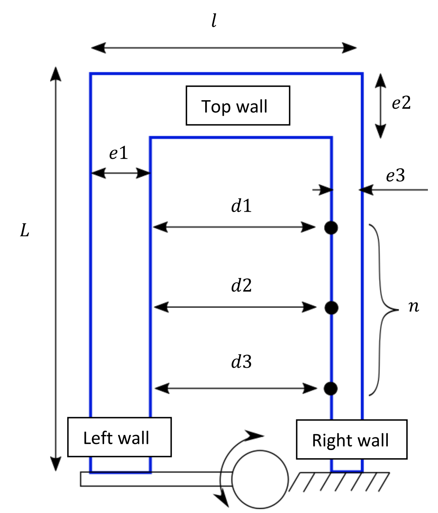
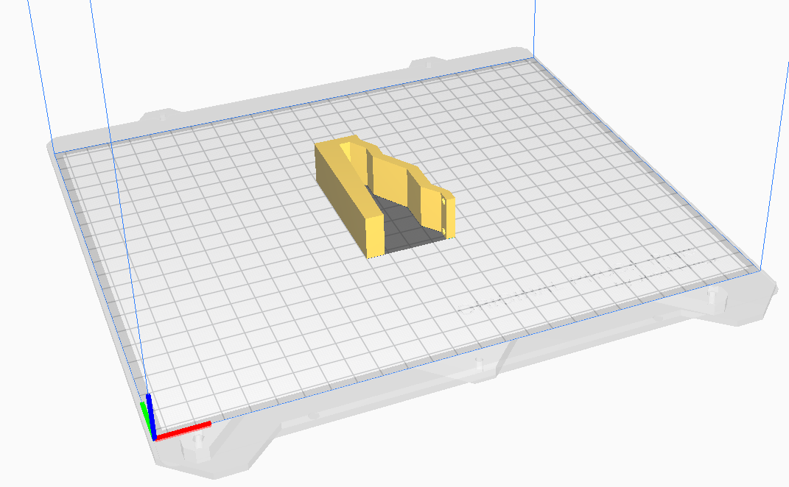

<script language="javascript">
function toggle(target) {
    d = document.getElementById(target);
    if(d.className === "show")
        d.className = "hide"
    else
        d.className = "show"
    return false;
}
</script>



## Context and objectives
In this hands-on session, we will tackle the problem of designing the deformable body of a soft robotics system while considering 
the constraints due to the fabrication process(es). For that purpose, we propose you to follow an iterative
and interactive design process where fast mechanical simulations are used to predict the system behavior and performances.

As a case study, you are going to optimize the design a soft gripper. There exists many design of
soft grippers with different geometries and actuation strategies, such as tendons and pneumatic. For this
session, the general design of the gripper is as follows (see Figure 1). It is composed of 3 soft fingers that are
actuated by one servo-motor each. As a note, the structural components and the configurations of the
servomotors are the same as the Tripod robot (see Tuesday’s hands-on session). While the actuation is
given, the question is how to optimize the finger design to maximize the grasping performances while
satisfying size and fabrication constraints. 



The goal of this hands-on session is to learn how to leverage parametric Computer Assisted Design (CAD) and
mechanical models to optimize the finger design iteratively. We propose in particular the use of a python
script that will automatically generate a geometry and a mesh, starting from a base finger design and
following simple inputs of design parameters. Participants who are already comfortable with soft
finger/robot design are free to propose their own CAD design of finger. Don’t hesitate to call the
session’s supervisors to discuss your designs! The fingers will be simulated using the mechanical FEM
model implemented in the SOFA software in order to have an evaluation of the grasping force. According
to the performances obtain, the participants will iterate manually on their design and repeat the process
until the design specifications are achieved.

Each participant will have to propose a design of finger at the end of the session, and justify their choice
by filling the form at the end of this document. The session supervisors will review the finger designs and
select 3 of them, based on the justifications given, to be 3D printed, assembled and tested.

## STEP 0: Preparations

### Python + Editor

The CAD generation script and the SOFA scene are both based on Python3 (version 3.7 or later). Despite any
text editor will work, we highly recommand the use of a dedicated IDE for python (pyCharm, Spyder, atom to cite few others).

### Gmsh
The python script interacts with Gmsh (by C. Geuzaine and J.-F. Remacle, version 4.9.5 or later) to
generate the volumes of the finger and discretize it with finite elements. To install it, execute the
following command in the Python terminal (http://gmsh.info).

```commandline
python3 -m pip install --upgrade gmsh
```

### SOFA
The mechanical model is implemented using SOFA (binaries of v22.06 with SoftRobots plugin). Please
refer to the hands-on session of Monday and Tuesday for installation.

### Ultimaker CURA
Once the finger will be designed, we will use the slicer software CURA to prepare its fabrication. 
The last version of the software can be found here:
https://ultimaker.com/fr/software/ultimaker-cura

### Hands-on session starting directory
The starting directory for this hands-on session includes a `details` directory that contains several files and folders:
- A `Data` directory where the generated meshes are stored. The directory initially contains the
servomotor 2D mesh (STL CAD) files and the mesh of the cylinder to grasp.
- Python scripts for the generation of the finger geometry and meshes:
  - `mesh_finger.py`
  - `mesh_clamping.py`
  - `mesh_contact_surface.py`
- A SOFA Python scene file and the utility python scripts that go with it
  - `gripper_simulation.py`
  - `actuated_finger.py`
  - `elastic_material_object.py`
  - `actuated_arm.py`
  - `fixing_box.py`
  - `s90_servo.py`
  - `cylinder.py`
- A CURA file to prepare the 3D printing program of the designed finger
  - `finger_cura.3mf`

## STEP 1: Determination of the design specifications
Any design process a robotic system, whether it is soft or not, should be conducted to obtain desired specifications.
The first step of the process is therefore to determine these specifications. They can be qualitative (ex: obtaining 
a bending motion with pneumatic actuation), quantitative (ex: elongating over 20% of its initial length), driven by 
an application (ex: must be soft enough not to damage living tissues in medical interventions) or constrained by the integration
of pre-existing parts (ex: the pneumatic components supports a maximum pressure of 100kPa) or by a fabrication process (obtained by casting).
The larger the number of specifications, the harder the design process is, in particular when some of them 
are conflicting each other (ex: generating large forces with a soft manipulator while being compliant to have safe contacts
with the environment). For this hands-on session, the design specifications are as follows:

- Criterion to maximize: contact force between the object to grasp and the soft finger at
equilibrium
- Object to grasp: cylinder of diameter 20 mm
- Grasping configuration: Servomotors arm set at 30°
- Maximum dimensions of the finger: 80.0 x 50.0 x 20.0 mm
- Assembly on the servomotor: wall with thickness 5mm to be anchored on the motor arm and
pass-through M3 holes for the anchoring to the gripper base (see section Servomotor Assembly)
- Fabrication process: Fused Filament Deposit additive manufacturing, Prusa i3 mk3 printer, Filaflex 70A material (Recreus),
extruder of diameter 0.4 mm, layer thickness of 0.3 mm, infill 25%.
- Quantity of material: 15g maximum

### Servomotors assembly



## STEP 2: Choice of a finger design and Generating its parametric CAD



The starting design of soft finger we propose is shown on Figure 3, in the configuration where the servomotor arm is at 0°.
The finger (in blue) consists initially in a U-shape, composed of left, top and right walls. The base of the left wall is fixed to the servomotor arm
while the right wall is fixed to the gripper base. When actuated, the servomotor pushes on the left wall,
provoking the finger’s bending. How much the finger will bend for the fixed servomotor angular
displacement, and how much force it will apply on an object to grasp, depends on the finger topology and dimensions.
Here, the topology is fixed, and you must determine its dimensions, this process being also called _dimensional synthesis_.
You have access to the following parameters to change this geometry.

| **Parameter** | **Description**                                                          |
|---------------|--------------------------------------------------------------------------|
| L             | Length                                                                   |
| l             | Width of the top wall                                                    |
| e1            | Thickness of the left wall at the finger top                             |
| e2            | Thickness of the top wall                                                |
| e3            | Thickness of the right wall                                              |
| n             | Number of intermediate points evenly spaced on the right wall            |
| di            | Distances between the intermediate points and the left wall (nx1 vector) |

From your choice of parameters, the python script `mesh_finger.py` generate the finger’s geometry and
the mesh elements the SOFA simulation needs. It first generates a series of points describing the contour
of the finger, then generate a surface from this contour and extrude it over a pre-defined finger
depth (imposed here). Don’t hesitate to look at the commented code. Finally, the script generates
several files from this volume:

- A 3D mesh made of tetrahedron elements for computing the elastic behavior
- A 2D mesh of the finger’s envelope for its visualization on SOFA and the detection of collisions
- 2D meshes of the inner and outer surfaces for the detection and computation of collisions

The script also generates automatically the geometries we need to attach the finger on the servomotor.
Also, the script incorporate the maximum dimension specifications described above. **Error messages** will
pop **in the terminal** in case the desired finger is too big or some geometries cannot be generated.
To generate a new design of finger, you must:

- Choose a set of design parameters
- Write their value at the beginning of the code using your favorite code editor
- From the `details` directory, execute the Python script using the command: `python3 details/mesh_finger.py`
- Check visually the consistency of the generated part using the now opened Gmsh window

The script will then automatically store the generated mesh files in the `Data` of the starting repository.
Note that the starting design we propose you to work with is not necessarily the best design nor the
most classical. There is today a vast library of finger and gripper designs in the soft robot community, and
finding the optimal one for a given grasping task is not trivial. The design presented here is simple
enough to give you some intuition about how the parameters influence the finger performances, but
other designs might work very well also. Don’t hesitate to discuss with the session supervisors about it!

## STEP 3: Simulation of the finger behaviour
The SOFA scene used to evaluate the elastic behavior of the finger and the contact force with the object
to grasp is provided in the file `gripper_simulation.py`. In this scene, we make use of the gripper symmetry
to reduce the overall computation time. As the three servomotors and fingers are at the same distance
to the object and equally distributed around it, they will apply the same force on it. Because of this, the
object is likely to stay approximately at the same location before and after grasping. Therefore, we
idealize the grasping scene by considering that the object is fixed in space and by simulating the behavior
of one finger only.


The scene contains:
- The 3D mesh of the finger along with an elastic force field to simulate its deformation
- A box with rigidified mesh nodes at the left wall base, which pose is updated according to the
servomotor rotation
- A box of rigidified mesh nodes at the right wall base which pose is fixed
- A mesh of the object to grasp, fixed in space.
- Collision models to account for eventual collisions between the finger and the object, and
between the inner surfaces of the left and right walls

<pre>
<a href="details/gripper_simulation.py"> Try the scene in SOFA.</a>
<a href="javascript:void(0)" onclick="toggle('step1code');"> Show/Hide the code.</a>
</pre>
<div id='step1code' class='hide'>
```python
..autofile::details/gripper_simulation.py
```
</div>
</div>

Don’t hesitate to go through the commented code of the SOFA scene for further details. To simulate the
finger behavior and determine the final contact force, you must:

- Launch the scene, by typing the following command in the terminal (for windows users, this
command works if runsofa.exe was previously included in the PATH environment variable) `gripper_simulation.py`
- Press the Animate button. The servomotor is controlled to reach the angular displacement in 3s.

To restart the simulation, press “Ctrl-R” (reload the scene) and then “Animate”.
Note that, in theory, only the final shape of the finger is important to us to evaluate the final contact
force. However, as the soft finger constitutes a non-linear elastic system, numerical solvers are likely to
diverge if the initial guess the user provides is too far from the actual solution. Therefore, computing
intermediate shapes of the finger during actuation improves numerical convergence.

## STEP 4: Evaluation of the finger performances
The SOFA scene is also equipped with controller that allows to get simulated data at each step of the simulation
and to read user keyboards input. In our case, we use it to display the total contact force between the finger
and the object, which is our main performance criterion. To evaluate and display the contact force:
- In the simulation, wait for the finger to reach an equilibrium configuration, i.e. the servo-motor and 
the finger stop moving.
- Print the contact force in the terminal by pressing on the keys “Ctrl+P”. Make sure you activated
the visualization window of SOFA by clinking on it when you want to interact with the simulation.

The value displayed in the terminal is the sum of the normal component of the contact forces applied on the
object. Just considering the normal component magnitude will be enough for this hands-on session, but considering the
force direction and the localization of the contact might also be of interest for a gripper design.  

## STEP 5: Iterate on the finger design to meet the specifications

So far, we performed only one design iteration through steps 1 to 4. Model-based design processes are generally iterative. 
The performances obtained for a given design are compared to the desired ones, and the design parameters are changed by 
the user to reduce the error (similarly to a closed-loop control scheme). This iteration process can be partly to fully 
automated using off-the-shelf numerical optimization methods such as gradient-descent. Note that using these tools may 
require additional work, such as reformulating the soft robot model and the optimization problem to obtain a mathematical 
form suitable for optimization (quadratic cost function to ensure convexity for example). Other methods like evolutionary 
algorithms can also be used to search the design space of parametric designs efficiently. Instead of optimizing a single candidate, 
these methods evaluate populations of candidates which evolve over generations.
In our case, to avoid going deep on the problem formulation and to get intuition on how the design parameters
affect the finger performances, we will iterate manually on the design parameters. Therefore, you need to:

- Repeat steps 1 to 4 until the design specifications are met

Some advices:
- Try to vary one parameter at a time (at least at the beginning), to learn its influence on the finger behavior
- Keep notes of what designs you already tried
- Be careful when choosing high values of the walls' thickness, as you might in fine go over the limit of material quantity
for the fabrication
- Be careful also when choosing low values of the walls' thickness, as it may conflict with the filament diameter. 

## STEP 6: Preparation for 3D printing and verification



When an optimal design is found, the last step is to check if the part can actually be fabricated, and if so to 
create the fabrication program. Here we consider 3D printing to fabricate the finger. This process requires
before-hands to create the printing program using a slicer software, here CURA. In this software, the part to
print must be included, positioned and oriented with respect to the printer building plate, and sliced to 
generate the path the extruder must follow.
- Open `finger_cura.3mf` using CURA. The software displays a 3D view of the printer and the building plate. We 
already specified the type of printer and the fabrication settings related to the flexible filament in the file.
- Click Open (foler icon on the top left) and select the surface mesh `finger.stl` in the Data folder. The finger
should now appear on the building plate.
- Check the orientation of the finger. This information is critical in 3D printing in general, as it will dictate 
the mechanical properties and geometrical tolerances of the final part. As the finger is an extruded planar shape,
and as we mainly need it to bend, the most natural orientation is with the planar shape coplanar with the building plane.
(as depicted on the Figure). If CURA did not already place the finger in this configuration, rectify this by selecting the part and using the 
buttons on the left. 
- Click on "Slice" on the bottom right
- Preview the 3D printing. Most slicer software propose this option. By clicking "Preview" on the bottom right (or 
the top center), and playing with the cursor on the right, you can visualize the different layers the printer will do.
- Check if the finger will be printed as intended.
- Check the quantity of material required for the fabrication on the bottom right. If the filament mass goes beyond the
maximum value of 15g (see specifications), you must go back to step 5 and adjust your design. You can leave CURA open and 
modify your design, the software will propose you to reload the file while keeping the same orientation.

## STEP 7: Description brief of the soft finger design

### For participants using the base design
1. What design parameters did you finally select? What is the final contact force you obtain?
2. How did you choose the number of intermediate points on the right wall and the inter-wall
distances between those points?
3. How did you choose the left, upper and right walls thickness?
4. How do these thickness values comply with the fabrication constraints?
5. What challenges did you face during the design process? Think in particular to the minimal wall
thickness that can be fabricated.

### For participants proposing their own design
1. Add a 3D view and/or planar schematics (in different planes) of your finger. What is the final
contact force you obtain?
2. How did you choose the finger global geometry?
3. How did you choose the finger dimensions?
4. How does the design comply with the fabrication constraints?
5. What challenges did you face during the design process? Think in particular to the minimal wall
thickness that can be fabricated and the layer thickness.
