<script language="javascript">
function toggle(target) {
    d = document.getElementById(target);
    if(d.className === "show")
        d.className = "hide"
    else
        d.className = "show"
    return false;
}
</script>

This tutorial describes how to use ..autolink::Sofa and the ..autolink::SoftRobots plugin in order to simulate a soft robot.
The first part is dedicated to the set up of the simulation environment and the modelling of a virtual soft robot. Then, the tutorial deals with the control of the real robot associated with the simulation.  
Once completed, the knowledge acquired from this tutorial on the robot called "Tripod" can be applied to other soft robots, thanks to the high modularity of SOFA.

Tutorial prequisites:

- you have installed ..autolink::Sofa with the ..autolink::STLIB and
..autolink::SoftRobots plugins.

- you have basic knowledge of the ..autolink::General::Python programming language. If this is not the case you can go to ..autolink::General::PythonTutorials.

- you have basic knowledge of scene modelling with SOFA. If not, please complete the ..autolink::SoftRobots::Docs::FirstStep tutorial first.

The robot "Tripod" considered here (see Figure 1 below) is actuated by three servomotors connected to a deformable silicone material. Each of them controls the deformation of one 'arm' of the silicone piece. By combining the effects of the three servomotors, is is possible to control the shape of the whole deformable part, which benefits from a theoritically infinite number of degrees of freedom.

<center>
<figure>
  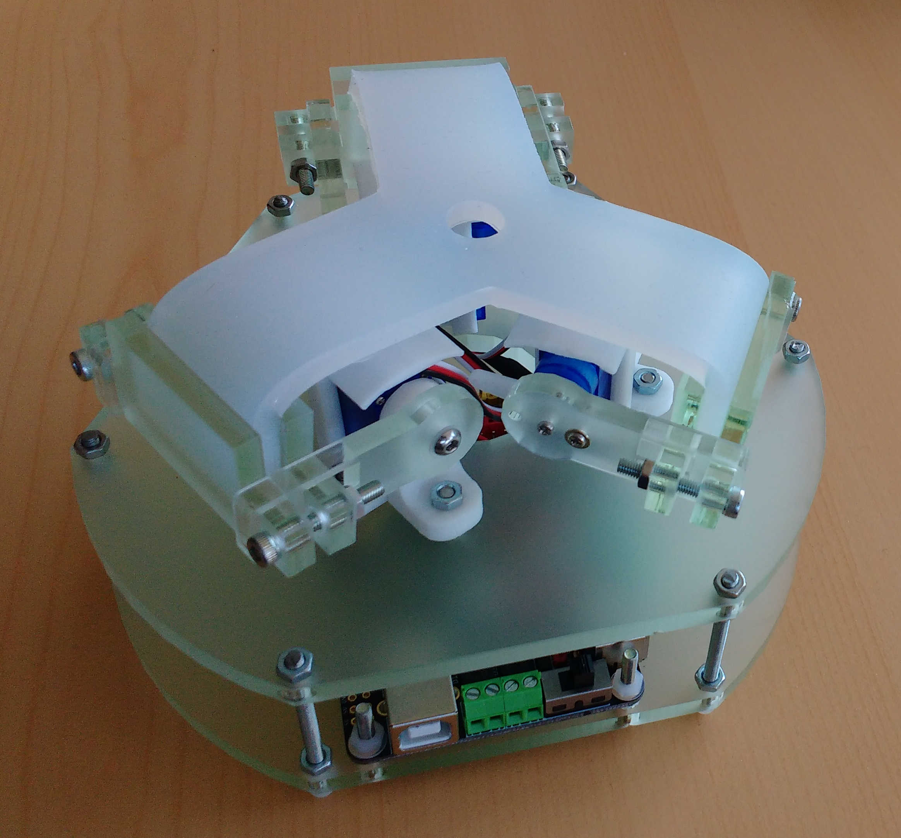
  <figcaption>Figure 1: Photo of the Tipod robot.</figcaption>
</figure>
</center>

Reminder of SOFA's GUI:

Once a scene is loaded in SOFA, you can click on the [*Animate*] button in the SOFA GUI to start the simulation. Once you have clicked anywhere on the 3D window, interactions are possible with the model on the 3D window and with the robot: depending on what was programmed, you can control the simulation to manipulate the robot, or interact with it by pressing *Ctrl+Keys*.

Note that with MacOS, you may have to use *cmd* instead of *Ctrl*.

Moreover, please note that, in order to send data to the robot, it can be necessary to have administrator rights.

# STEP 1: Building the Mechanical Model for the soft part & its Visual Model

## <i>At the end of this step, you will be able to:</i>
- Build the mechanical model of the silicone piece of the robot
- Build the corresponding visual object
- Use meshes for the mechanical description of a soft object

## <i>Reminders of the First Steps tutorial </i>
- All the objects simulated in a scene are described in nodes attached to the main node `rootNode`. For this robot, there will be different objects, including one for the silicone piece (`ElasticBody`). Each of them is defined with the function `node.createChild()`.
- In order to automatically reload the scene when changes are made, run the scene with the `-i` option.
- The properties of any object can be accessed by double-clicking on it in the *Graph* panel of the SOFA GUI.
- By right-clicking in the *Graph* panel, the code file can be opened (*Open file in editor* in the dropdown menu)

The first two steps aim at modelling the deformable silicone piece of the robot.  The objects composing it are added one by one with the function `node.createObject()`. Just like in the ..autolink::SoftRobots::Docs::FirstStep tutorial, a mechanical model of the piece is first created, called `ElasticBody`. As the silicone piece is soft and can be deformed through constraints, it is necessary to describe its entire volume (and not only its center of gravity as it is usually done for rigid objects). Based on its shape, it is discretized: here it is decomposed into tetrahedral elements, linking all the points - or nodes - of the volume. This discretization produces the following types of elements: tetrahedrons, triangles, lines, and points. These elements are listed into a `MechanicalObject` named "dofs". The mesh file describing the discretization into tetrahedral elements is "tripod_mid.stl". The data provided by the meshes must be organized and stored into different data fields (one for the positions of the nodes, one for the triangular elements, ...) before SOFA uses them for computation. This formatting is done by means of code blocks called *loaders*.
The loader used here, `MeshSTLLoader` is designed for `STL` files.  
The mass distribution of the piece is implemented, as well as a time integration scheme (implicit Euler method) and a solver (here the quick resolution method using the LDL matrix decomposition).  
Then, a Visual model of the piece is built, using the same mesh file as for the mechanical model. Because it was decided (for the sake of simplicity) to use the same meshing for both models, the loader is introduced in the rootNode.  
Finally, the two representations are linked together by a mapping, which allows to adapt the visual model to the deformations of the mechanical model of the soft piece. As the same mesh is used for both the mechanical and the visual model, the mapping is simply mirroring the mechanical model to adapt the visual one. This is why we use an `IdentityMapping` here.

The resulting simulation looks like this:
<pre>
<a href="details/step1.py"> Try the scene in SOFA.</a>
<a href="myproject/step1.py"> Write it yourself.</a>
<a href="javascript:void(0)" onclick="toggle('step1code');"> Show/Hide the code.</a>
</pre>
<div id='step1code' class='hide'>
```python
..autofile::details/step1.py
```
</div>
</div>


## <i> Exploring the scene </i>

<!-- For more information on vector graphics, see -> lien vers la doc -->

- Try to orient the object differently on the 3D window by modifying its properties. Step 1 of the  tutorial can be used as a guideline.
- In the *View* panel of SOFA GUI, by enabling the *Options*, you can see the discretization of the silicone piece into tetrahedral elements.
- Identify the white squares, each representing one point (one degree of freedom) of the MechanicalObject, on which the deformations are computed.

## <i>Remarks</i>
- SOFA implements default length and time units, as well as a default gravity force. The user defines his own time and space scale by defining the constants of the model. Here, the gravity of our simulation is defined such as the length unit is in centimeters; and the time unit chosen is the second, which means that the timestep is of one millisecond.
- There is a graphic modelling in the scene to display the legends associated with the servomotors (see Figure 2 below), that are described in the file `blueprint.stl`.

<center>
<figure>
  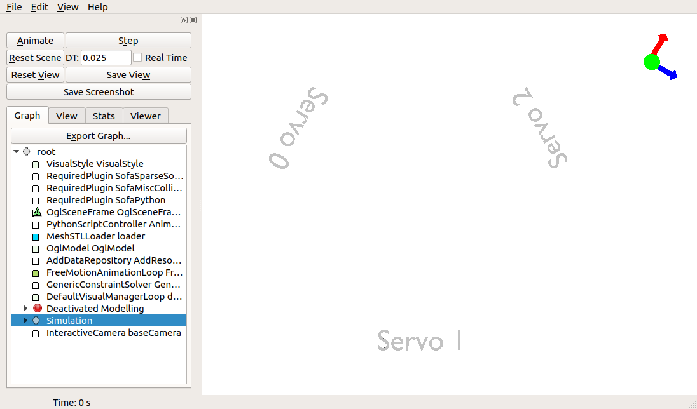
  <figcaption>Figure 2: Legends of the servomotors' positions, as described in the file `blueprint.stl`.</figcaption>
</figure>
</center>


# STEP 2: Modelling the possible deformations of the soft material

## <i>At the end of this step, you will be able to:</i>
- Build an elastic deformation model based on the Finite Element Method
- Understand what a *ForceField* is

Unlike the rigid objects modelled in the FirstSteps tutorial, the silicone piece is deformable, and as such, requires additionnal components describing the behavior of the material when it is submitted to mechanical constraints.  
In order to implement the deformation behaviour, the `MechanicalObject` must be connected to one or multiple *ForceFields*. These Forcefieds are in charge of computing the internal forces that will guide the deformation of the soft piece. Many different mechanical behaviors exist and it is important to understand the one that best approximates the behavior of the real object. In particular, it is important to know how soft or stiff the material is, as well as if it has an elastic behaviour or a more complex one (hyperelastic, plastic, etc...). In our case, it has been chosen to implement a law of elastic deformation, modelled using the Finite Element Method (..autolink::General::FEM). Its parameters are the Young modulus, and the Poisson ratio.  

```python
elasticbody.createObject("TetrahedronFEMForceField", youngModulus=250, poissonRatio=0.45)
```

In SOFA, the ..autolink::STLIB::ElasticMaterialObject from `stlib3.physics.deformable` provides a ready to use prefabricated object
to easily add such an object in our scene. It defines the whole mechanical model of a deformable elastic object.  

```python
ElasticMaterialObject.createPrefab(node,
                                    volumeMeshFileName,
                                    name,
                                    rotation,
                                    translation,
                                    surfaceColor,
                                    poissonRatio,
                                    youngModulus,
                                    totalMass,
                                    solver)
```

However, before using this prefabricated object, let's first build our own, based on a corotational Finite Element Method with a tetrahedral volumetric representation of the shape. The mesh `tripod_mid.gidmsh` used to store the shape of the deformable object was built with the GiD mesh generator. Starting from the model obtained in the last step, the parameters of the elastic deformation are added to the silicone piece with a `ForceField` component.  


<pre>
<a href="details/step2.py"> Try the scene in SOFA.</a>
<a href="myproject/step2.py"> Write it yourself.</a>
<a href="javascript:void(0)" onclick="toggle('step2code');"> Show/Hide the code.</a>
</pre>
<div id='step2code' class='hide'>
```python
..autofile::details/step2.py
```
</div>
</div>

## <i>Exploring the scene</i>
- By starting the scene, the tetrahedral mesh with blue-ish elements appears. To control the visualization of this computation mesh, you can either check the *ForceFields* option within the *View* panel in the runSofa GUI
or, as done here in the code, change the displayFlags property of the ..autolink::Sofa::VisualStyle.
- Up to now, an elastic material has been modelled. It is subjected to the gravity force, and it follows an elastic law when it is deformed. Thus, once the scene is started ([*Animate*] button), the silicone piece 'falls' on the 3D window.
- The links proposed in the tutorial are shortcuts to the automatically generated documentation of the plugin that you can see here: <a href="https://stlib.readthedocs.io/en/latest/"> Readthedocs for STLIB </a>. It contains a description of the templates that have been desingned in the STLIB plugin and helps when designing a scene.

# STEP 3: Adding externals constraints

<center>
<figure>
  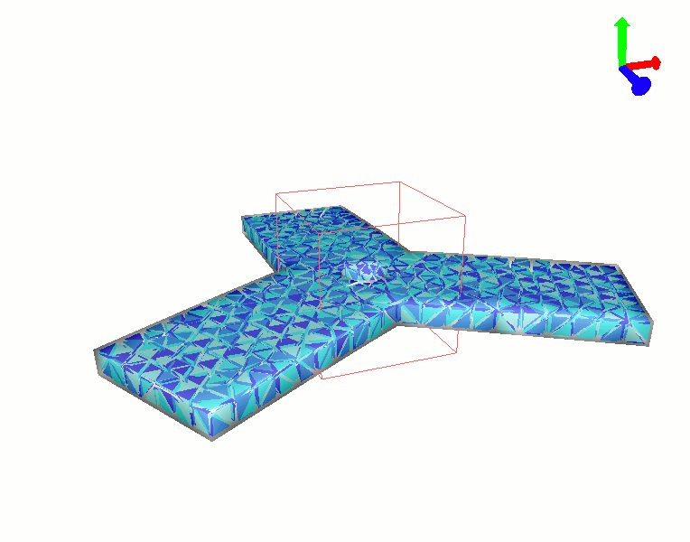
  <figcaption>Figure 3: Interaction with the soft material with the central part fixed.</figcaption>
</figure>
</center>


## <i>At the end of this step, you will be able to:</i>
- Add constraints on specific areas through the use of the Fixing Box ROI prefab
- Understand how the Fixing Box is implemented
- Build functions to bring together all the components of an object

In this step, the prefab `FixingBox` is described, that allows to fix the position of some areas of a physical object in space. (ROI stands for Region Of Interest.) It will be used in this step to prevent the falling of the silicone piece under gravity, by constraining the position of its central part. The prefab object is called via the following function:

```python
FixingBox(ParentNode, ApplyTo, translation, scale)
```
In parallel, in order to lighten the code and ease the reading, the introduction of a function `ElasticBody(parent)`{.python} is proposed in this step, bringing together all the components of the silicone piece model. This function also uses the prefab `ElasticMaterialObject`, that implements the mechanical model of an elastic material (including a mesh loader, mass definition, time integration and solver tools, and the description of the Force Fields).  
Such a function is defined at the beginning of the scene, and can be called as often as wished in the description of the scene (i.e. in the function `createScene(rootNode)`{.python}).

<pre>
<a href="details/step3.py"> Try the scene in SOFA.</a>
<a href="myproject/step3.py"> Write it yourself.</a>
<a href="javascript:void(0)" onclick="toggle('step3code');"> Show/Hide the code.</a>
</pre>
<div id='step3code' class='hide'>
```python
..autofile::details/step3.py
```
</div>
</div>

## <i>Exploring the scene</i>
- The constraint implemented by the FixingBox *prefab*, named `RestShapeSpringForceField`, applies in fact elastic spring forces on the points of the mechanical object (the degrees of freedom) included in the `FixingBox`, to bring them back to their resting position whenever a modification is computed (due to gravity forces for example). The stiffness of these 'springs' is set at a very high level, which produces immediate correction of any change in position: the constrained points cannot move anymore.
- The box can be moved anywhere to constraint another area. For example, the translation `[30.0,0.0,30.0]`{.python} allows to constraint the end of the arm connected to servo 2.
- By clicking on the [*Animate*] button, it can be observed that the FixingBox indeed prevents the silicone piece to fall under gravity force. The unconstrained tips of the piece, however, experience a light bending.
- It is possible to deform the silicone piece with the mouse, by pressing *Maj* while left-clicking on the piece, then dragging the mouse. This can be used to observe how elastic the material is. By changing the value of the Young modulus, you can compare the rendering of the simulated piece with the real one (for example, test values from 10 to 2000 for the Young modulus after having manipulated the silicone piece on the real robot a bit, to get an idea of its elasticity).


# STEP 4: Adding actuators and connecting to deformable part

<center>
<figure>
  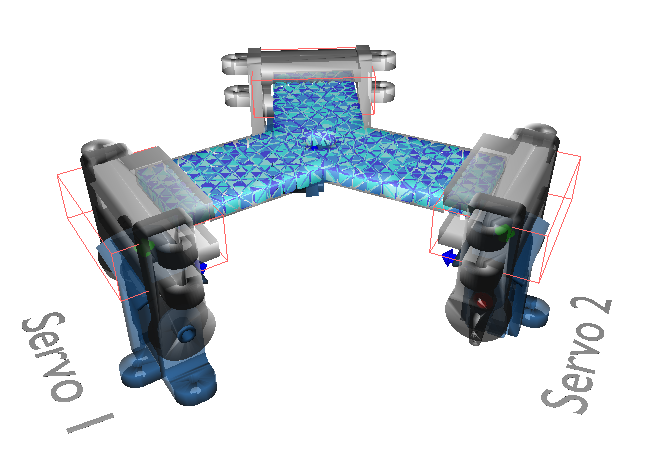
  <figcaption>Figure 4: Tripod assembly.</figcaption>
</figure>
</center>

## <i>At the end of this step, you will be able to:</i>
- Add prefabs for the actuators (STEP 4-1)
- Rigidify some parts of the deformable model (STEP 4-2)
- Attach the the rigidified parts to the actuators (STEP 4-3)


# STEP 4-1: Adding actuators

## <i>At the end of this step, you will be able to:</i>
- Add prefabs for the actuators
- Position them according to the real robot positionning
- Understand the structure of the prefabs modelling the S90 servomotors and the associated servo-arms used on the Tripod robot: `ServoMotor`, `ServoArm` and the prefab `ActuatedArm` that brings the first two together.
- Understand another graph structure for the objects of the scene, by introducing the object *Simulation*.

It is now time to add the actuators that will deform the elastic piece. On the real robot, this is done by 3 servomotors actuating servo-arms attached to the silicone piece. On SOFA, two prefabricated objects have been implemented and brought together in a third one named ActuatedArm. The two elements composing it can be seen on Figure 5 below. The prefabs are described in a python file, that contains all the elements of the model of the object. They are imported at the beginning of the code file of the scene, and can then be used in the scene. The lines to import the ServoArm and the ActuatedArm prefab are the following:

```python
from actuatedarm import ActuatedArm
from tripod import ElasticBody
```

`actuatedarm` and `tripod` (as well as `s90servo` that is used in the `actuatedarm` file) are the names of the python scripts that describe the prefabs. They are located in the folder 'details' of the Tripod tutorial (same folder as the scripts for the separate steps of the tutorial).

<center>
<figure>
  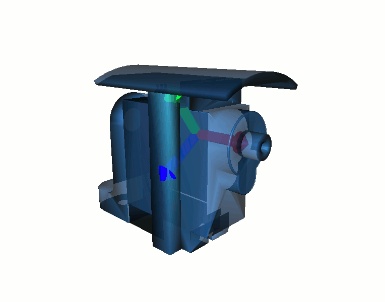
  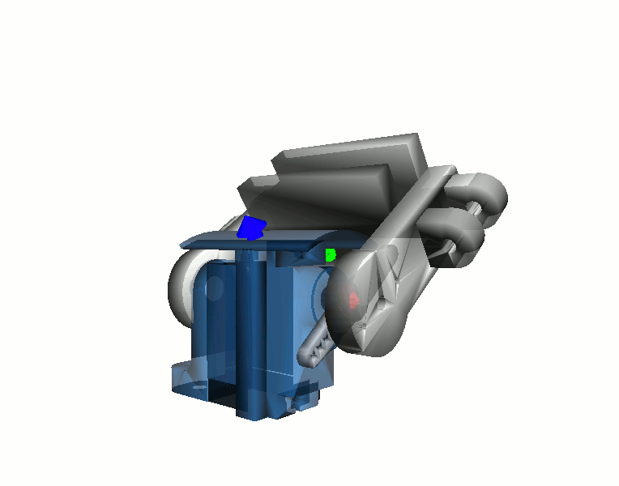
  <figcaption>Figure 5: Display of the servomotor (left) from *SG90_servomotor.stl* and servo-arm mounted on the servomotor (right) from *SG90_servoarm.stl*.</figcaption>
</figure>
</center>

The prefab ActuatedArm is building up the ensemble composed of a servomotor and a servo-arm, and includes a Fixing Box situated at the tip of the servo-arm, that attaches the silicone piece to the servo-arm.

```pyhton
ActuatedArm(parent, name, translation, eulerRotation, attachingTo)
```
It uses the prefabs ServoMotor and ServoArm, that are described as rigid objects and implemented in the files *s90servo.py* and *actuatedarm.py* respectively. By opening those files, you will see that the prefabs are actually defined as classes. At the end of the file, you can find a small scene in the function `createScene()` that provides an example of use of the prefab.

```python
ServoMotor(parent, translation, rotation, scale, doAddVisualModel)

ServoArm(parent, mappingInput, name)
# The mappingInput corresponds to the rigid mechanical object that will control the orientation of the servo-arm, in our case it will be the ServoWheel prefab (see 'Exploring the scene' for more details)
```

The mechanical model of the ServoMotor and the ServoArm is described in their prefab, but it doesn't include a time integration scheme nor a solver. In the previous steps, these were added in the object's node. However, in this step, a different organization is proposed: the mechanical & visual models of the objects are created on one side, grouped in a node called Tripod; and a node 'Simulation' is built on the other side, that implements time integration and a solving tool, and links them to their corresponding object. This linking is done thanks to the object *Scene* from the file `tutorial.py` located in in the same directory, that is also imported at the beginning of the code file.  
Just like for the `ElasticBody`, a function `Tripod()` is introduced, now that all the pieces of the robot have been modelled:

```python
Tripod(parent, name="Tripod", radius, numMotors, angleShift)
```

<pre>
<a href="details/step4-1.py"> Try the scene in SOFA.</a>
<a href="myproject/step4-1.py"> Write it yourself.</a>
<a href="javascript:void(0)" onclick="toggle('step4-1code');"> Show/Hide the code.</a>
</pre>
<div id='step4-1code' class='hide'>
```python
..autofile::details/step4-1.py
```
</div>
</div>

## <i>Exploring the scene</i>
- Explore the *Info* panel in the window that appears when double-clicking on the different components: you can observe that the prefab objects propose some documentation and a description of specific properties
- Explore the hierarchy of the nodes in the *Graph* panel, to observe the structure of the `ActuatedArm` prefab.
More particularily, in the `ServoMotor` prefab of each `ActuatedArm`, a `ServoWheel` prefab can be seen. It represents the capability - or degree of freedom - of the servo-arm to rotate around the motor shaft. It is implemented in the file *s90servo.py* and composed of a Rigid `MechanicalObject`, on which the rotations are applied, and then transferred to the `ActuatedArm` on which the `ServoWheel` is attached.
- My modifying the `EulerRotation` and `translation` parameters of the `ActuatedArm` instances, try to constrain different parts of the model.

## <i>Remarks</i>

- Different solvers have been used so far: `SparseLDLSolver` for the former steps, and here, the `CGLinearSolver` (using the Conjugate Gradient method) introduced in the *Simulation* object. The difference in the results of the simulation, depending on the solver used is negligible in the scenes presented in this tutorial.
- However, the solving methods sometimes have properties that allow particular manipulations of the objects in the scene. By using the `CGLinearSolver` for the servomotors, it is possible to move the servomotor base in the simulation window by holding the *Shift* key while left-clicking on the servo base to drag it. This shows the connection with the silicone piece, that follows the mouvement, like it would with the real robot.
- Note that the same *Shift + Click-and-drag* manipulation isn't possible on the servo-arm alone. Indeed, since the arm is constrained by the servomotor, trying to move it away from the servomotor would produce a conflict situation and the system would diverge.


# STEP 4-2: Rigidify parts of the deformable piece

<center>
<figure>
  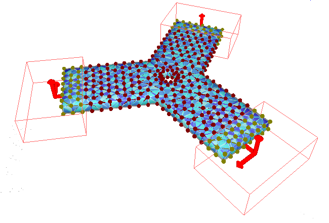
  <figcaption>Figure 6: Deformable piece with the extremities rigidified.</figcaption>
</figure>
</center>

## <i>At the end of this step, you will be able to:</i>
- Rigidify some parts of a deformable object

<pre>
<a href="details/step4-2.py"> Try the scene in SOFA.</a>
<a href="myproject/step4-2.py"> Write it yourself.</a>
<a href="javascript:void(0)" onclick="toggle('step4-2code');"> Show/Hide the code.</a>
</pre>
<div id='step4-2code' class='hide'>
```python
..autofile::details/step4-2.py
```
</div>
</div>


# STEP 4-3: Attach the acutators to the deformable piece

<center>
<figure>
  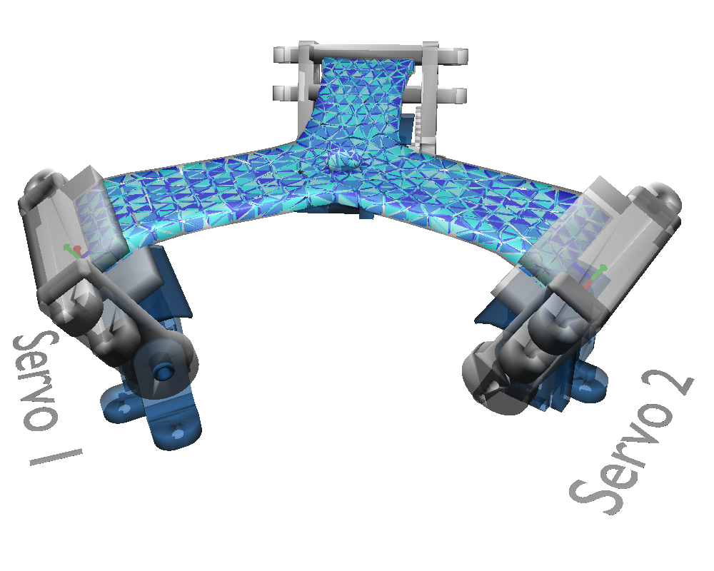
  <figcaption>Figure 7: Deformable piece with the extremities rigidified and attached to the servoarms.</figcaption>
</figure>
</center>

## <i>At the end of this step, you will be able to:</i>
- Link a deformable object to a rigid actuator

<pre>
<a href="details/step4-3.py"> Try the scene in SOFA.</a>
<a href="myproject/step4-3.py"> Write it yourself.</a>
<a href="javascript:void(0)" onclick="toggle('step4-3code');"> Show/Hide the code.</a>
</pre>
<div id='step4-3code' class='hide'>
```python
..autofile::details/step4-3.py
```
</div>
</div>


# STEP 5: Adding controllers

<center>
<figure>
  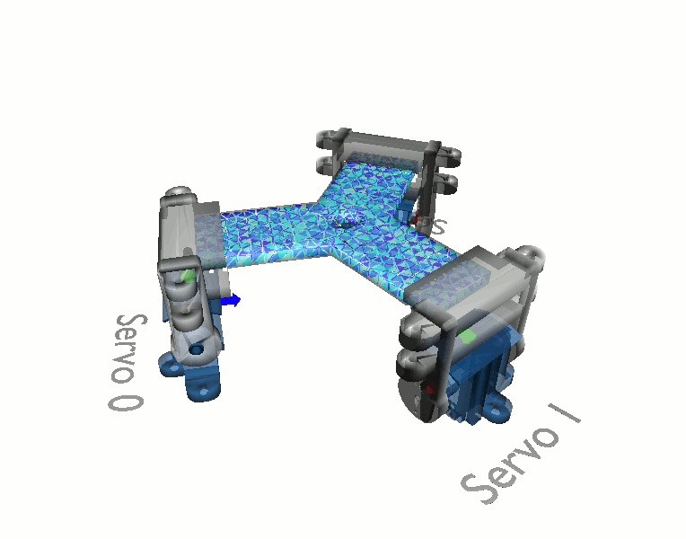
  <figcaption>Figure 8: Tripod initialisation animation.</figcaption>
</figure>
</center>

## <i>At the end of this step, you will be able to:</i>
- Implement a controller for interactive change of the servomotors angular position with keyboard keys
- Define an animation function, that acts on the actuators by translating & rotating them

The servomotors have a default angular position, that corresponds to an angle of 180°. To interactively change this default position, a dedicated object will be added, called a *Controller*. Controllers allow to implement custom behavior and end-user interaction directly, using python.

In this step we are adding such a controller, in order to be able to control the position of each servo-arm with keyboard keys. On the real robot, the initial position considered is the one when the silicone piece is laying flat, which means that the servomotors are at an angle of 90°.  
The keys involved in the control and the effect they trigger are described below:  
The following combinations allow to control the angular position of the servomotors, separately:
<!-- see table  without word wrap for clearer view -->

Keyboard keys[^credits]                                                                                              Effect on angle          For Servo
---------------------------------------------------------------------------------------------------------          ----------------------   --------------
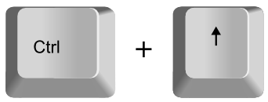                          Increase                 0
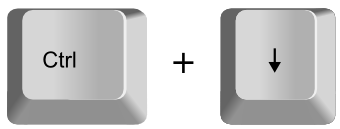                      Decrease                 0
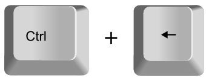                      Increase                 1
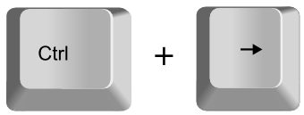                    Decrease                 1
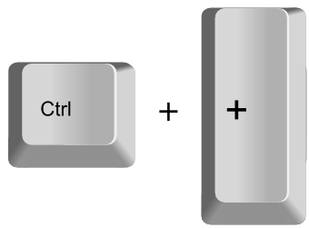                         Increase                 2
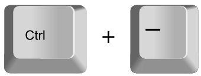                       Decrease                 2

SOFA allows a default animation management: this is what was being used up to now. In this step, we want to add a more specific animation that updates the scene at each timestep, depending on the keys pressed by the user. The control of this animation is done thanks to a python script controller (`class CONTROLLER_NAME(Sofa.Core.Controller)`) that is added in our scene file. It uses the function (or *method*) `onKeypressedEvent()` that is included in SOFA by default and that triggers an action if a designated key is pressed.
The controller is implemented such as, after each key press, the designated servomotor moves from  a `stepsize` value of *0.1* rad (that is a little less than 6°) by changing the value of the attribute `ServoMotor.angleIn`.  
Moreover, another animation is added in the function `setupanimation(actuators, step, angularstep, factor)`, in order to move with one keystroke the three servomotors from their default angular position to the initial position of the real robot. It is triggered by the following keystroke:
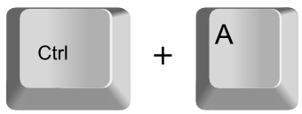
The animation is implemented, using the function `animate(cb, params,duration)` from the STLIB plugin, and the function `setupanimation(actuators, step, angularstep, factor)`. The `animate` function calls `setupanimation` and provides the structure of the animation: a small variation of the parameters (`step` value) is computed each time that the `steupanimation` function is called; the `animate` function is a recursive function, that calls itself over and over again, as long as the `duration` value hasn't been reached.  
The controller is added as another node in the scene.

<pre>
<a href="details/step5.py"> Try the scene in SOFA.</a>
<a href="myproject/step5.py"> Write it yourself.</a>
<a href="javascript:void(0)" onclick="toggle('step5code');"> Show/Hide the code.</a>
</pre>
<div id='step5code' class='hide'>
```python
..autofile::details/step5.py
```
</div>
</div>

## <i>Exploring the scene</i>
- After clicking on the [*Animate*] button, and then anywhere in the simulation window, use the defined keystrokes to deform the silicone shape by controlling the angular position of the servomotors.
- Try to implement a different animation, modifying the initial position of the angular position of the servomotors.

## <i>Remark</i>
When the scene is loaded and animated, it can be interesting to display the execution time's distribution between the different components of the simulation. For that purpose, activate the *Log Time* option in the *Stats* panel of the simulation window. The steps duration statistics appear then in the terminal window. A screenshot of it can be seen below in Figure 9. If you're using the distributed binaries or have compiled SOFA with QtCharts and QtWebEngine installed, you can activate the *Display AdvanceTimer profiler* option in the *Stats* panel of the simulation window. A window with the steps duration statistics will pop up. A screenshot of it can be seen below in Figure 10.

The most time consuming process - and thus the one requiring the greatest computing resources - is related to the computation of the Mechanical behaviour, with more than half of the resources allocated to the *solving* tools. This highlights the complexity of the system and explains why the mesh cannot be endlessly tightened: the simulation would take a great amount of time to compute, too much for any real time application.

<center>
<figure>
  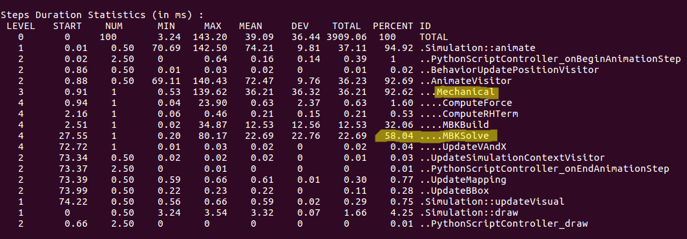
  <figcaption>Figure 9: Steps Duration Statistics, as seen in the terminal window with which the tutorial was run</figcaption>
</figure>
</center>

<center>
<figure>
  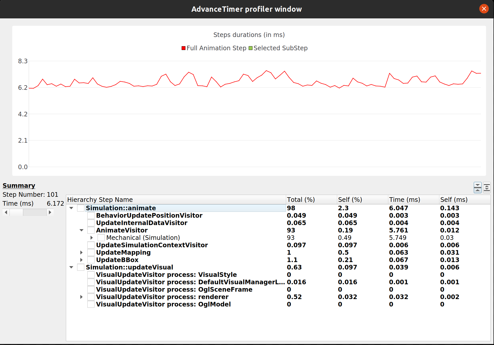
  <figcaption>Figure 10: Steps Duration Statistics, as seen in the AdvanceTimer Profiler window</figcaption>
</figure>
</center>

# STEP 6: Adding collision models

<center>
<figure>
  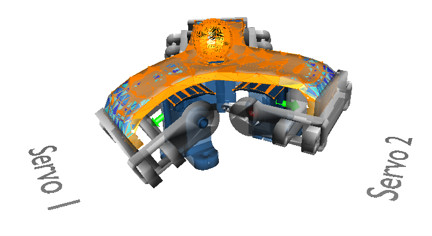
  <figcaption>Figure 11: Tripod simulation with collision between a sphere, the deformable part and top of the three servomotors</figcaption>
</figure>
</center>

## <i>At the end of this step, you will be able to:</i>
- Add a rigid object that interacts with the robot thanks to a collision model
- Add a collision model so that the silicone piece can no longer go through the servomotors.

By default SOFA doesn't handle collisions as they are very expensive to compute. To activate collisions you need to define specifically the geometries for which collisions are checked and how they are handled. In this step we are adding a rigid Sphere object falling on the robot, as well as the description of the contact management between the ball and the silicone piece.  
(This scene is defined for the simulation only, the interaction with the real robot has not been added.)

A new controller, called `JumpController`, is also added to change rapidely the servo motors angles so the robot can play with the falling ball.

The same keystrokes as in the previous steps are used, adding two new intermediate positions for a more dynamical response.

- Keystroke to move the servomotors from their default position to the initial one of the real robot: 
- Keystroke to position the servomotors to an intermediate position: 
- Keystrokes to position the servomotors to a high angular position: 
- Keystrokes to control the angular position of each servomotor:

Keyboard keys                                                                                                      Effect on angle          For Servo
----------------------------------------------------------------------------------------------------------      ----------------------   --------------
                       Increase                 0
                   Decrease                 0
                   Increase                 1
                 Decrease                 1
                      Increase                 2
                    Decrease                 2

<pre>
<a href="details/step6.py"> Try the scene in SOFA.</a>
<a href="myproject/step6.py"> Write it yourself.</a>
<a href="javascript:void(0)" onclick="toggle('step6code');"> Show/Hide the code.</a>
</pre>
<div id='step6code' class='hide'>
```python
..autofile::details/step6.py
```
</div>
</div>

## <i>Exploring the scene</i>
- Once the scene animated, observe how the ball follows the mouvement of the silicone piece: as lond as the ball 'sits' into the small hole at the center of the piece, it follows its mouvements. However, if the silicone piece is sloped enough, the ball falls under gravity force.
- Thanks to a collision model between the top of the servomotors and the silicone piece, the silicone piece can no longer go through the servomotors.


# STEP 7: Connecting to the  physical robot

## <i>At the end of this step, you will be able to:</i>
- Connect the simulated robot to the real one.
- Directly control the angular position of ther real servomotors by actuating the simulated ones.

It is now time to connect our simulated robot to the real one. This requires the addition of two elements. The first one, `SerialPortBridgeGeneric`, is a component that defines how the communication through the USB/Serial port is handled; it is an object of the rootNode.  
The second one, `SerialPortController`, is another Controller, reading the angular position of the simulated servomotors (in one of their data field) and sends them via the USB communication cable. The angular position of the simulated servomotors is stored in `actuators[i].ServoMotor.angleIn` in radian, and is transfered to the field `serialport.packetOut` of the controller board.  
Because the data are now sent to the real robot, it is necessary to implement a limitation of the possible angular positions to be reached: between 60 and 180 degrees. Any angle outside this interval is limited to the interval's extrem value instead.

The keystrokes implemented are the same as for the previous steps, adding one to start sending data to the robot.

- Keystroke to start sending data to the real robot: 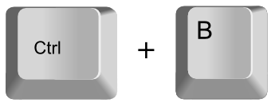
- Keystroke to move the servomotors from their default position to the initial one of the real robot: 
- Keystrokes to control the angular position of each servomotor:

Keyboard keys                                                                                                     Effect on angle          For Servo
----------------------------------------------------------------------------------------------------------      ----------------------   --------------
                      Increase                 0
                  Decrease                 0
                  Increase                 1
                Decrease                 1
                     Increase                 2
                   Decrease                 2


<pre>
<a href="details/step7.py"> Try the scene in SOFA.</a>
<a href="myproject/step7.py"> Write it yourself.</a>
<a href="javascript:void(0)" onclick="toggle('step7code');"> Show/Hide the code.</a>
</pre>
<div id='step7code' class='hide'>
```python
..autofile::details/step7.py
```
</div>
</div>

## <i>Exploring the scene</i>
- Start the scene with the [*Animate*] button, then click anywhere in the simulation window and type the keystroke to start sending data to the real robot. Observe how the real robot responds to the modifications of the simulation: this is the direct control, where the user specifies the angular position to reach, which are then also sent to the robot.
- Remark how the real robot is limited in his movements, while nothing prevents the user to make complete turns aroud the motor shaft with the servo-arms in the simulation.


# STEP 8.1: Inverse control
In the previous steps we where controlling  the robot by directly specifying the angle of the ServorMotor object. In this step we will use SOFA to inverse the model and adding an effector to the simulation so that it becomes possible to specify the effector's position and let the simulation compute the angular positions to apply to reach the effectors's position.

The same keystrokes as in the previous steps are used, adding a new one to start the inverse resolution.

- Keystroke to start sending data to the real robot: 
- Keystroke to move the servomotors from their default position to the initial one of the real robot: 
- Keystroke to start the inverse resolution: 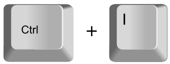

<pre>
<a href="details/step8.py"> Try the scene in SOFA.</a>
<a href="myproject/step8.py"> Write it yourself.</a>
<a href="javascript:void(0)" onclick="toggle('step8code');"> Show/Hide the code.</a>
</pre>
<div id='step8code' class='hide'>
```python
..autofile::details/step8.py
```
</div>
</div>

# STEP 8.2: Defining a motion path for the maze

<center>
<figure>
  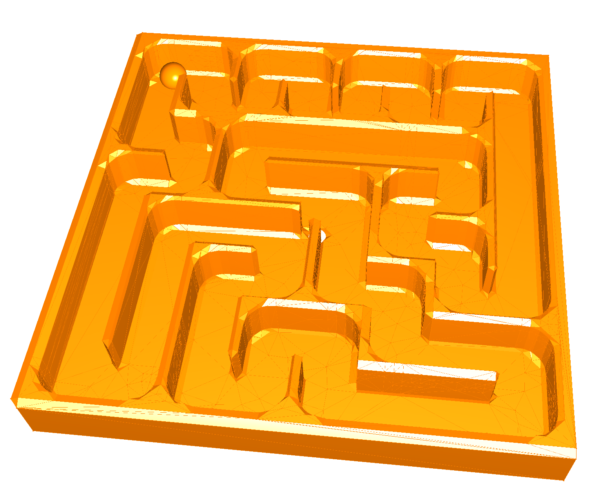
  <figcaption>Figure 12: Maze with a little ball.</figcaption>
</figure>
</center>

In the previous steps we where controlling the robot in inverse mode interactively. We want now to make the robot follow a predefined path. For that we will play with a maze. Let's try to define a path that will move a little ball inside the maze. Open the file mazeplanning.json, and add new points, then press ctrl+r to reload the scene and verify the results in simulation. Tips: To make the trajectory work well on the robot, try to emphasize the movements. Sometimes the ball rolls 
better in the simulation than in reality.

<pre>
<a href="details/maze.py"> Try the scene in SOFA.</a>
<a href="myproject/maze.py"> Write it yourself.</a>
<a href="javascript:void(0)" onclick="toggle('step8.2code');"> Show/Hide the code.</a>
</pre>
<div id='step8.2code' class='hide'>
```python
..autofile::details/maze.py
```
</div>
</div>

# STEP 8.3: Inverse control to follow a predefined motion path

<center>
<figure>
  
  <figcaption>Figure 13: Tripod with maze on top.</figcaption>
</figure>
</center>

We can now include the maze trajectory withing the tripod robot scene to make a full simulation and compare it with the real-world example. Run the scene step8-maze.py, and press ctrl+a to set the Tripod in the starting configuration, then press ctrl+i to start the inverse resolution. 

<pre>
<a href="details/step8-maze.py"> Try the scene in SOFA.</a>
<a href="myproject/step8-maze.py"> Write it yourself.</a>
<a href="javascript:void(0)" onclick="toggle('step8.3code');"> Show/Hide the code.</a>
</pre>
<div id='step8.3code' class='hide'>
```python
..autofile::details/step8-maze.py
```
</div>
</div>

# STEP 9 : Closed-Loop Control

We can now include an IMU sensor to get the orientation of the maze.
Before loading the scene, upload the correct arduino code.

<center>
<figure>
  
  <figcaption>Figure 12: Tripod orientation.</figcaption>
</figure>
</center>

We want now to implement the following controller.
<center>
<figure>
  
  <figcaption>Figure 13: Block diagram cloded Loop.</figcaption>
</figure>
</center>

<pre>
<a href="arduino/servoTimerDFRobot/ServoTimerDFRobot.ino"> Arduino code for IMU.</a>
<a href="arduino/servoTimerAdafruit/ServoTimerAdafruit.ino"> Arduino code for adafruit.</a>
<a href="details/closedLoopController.py"> Try the scene in SOFA.</a>
<a href="myproject/closedLoopController.py"> Write it yourself.</a>
</pre>


# Conclusion
Congratulation, you completed this tutorial. You are strongly encouraged to pursue with the other tutorials.

If you have any comments or suggestions, please submit issues on our ..autolink::github/SoftRobots page.

[^credits]: All keyboard keys come from Kai Noack's 'Free Keyboard Graphics and Key Icons for Screencasts', that can be found at this adress <https://github.com/q2apro/keyboard-keys-speedflips/>. Many thanks to him for publishing it in the free domain.
